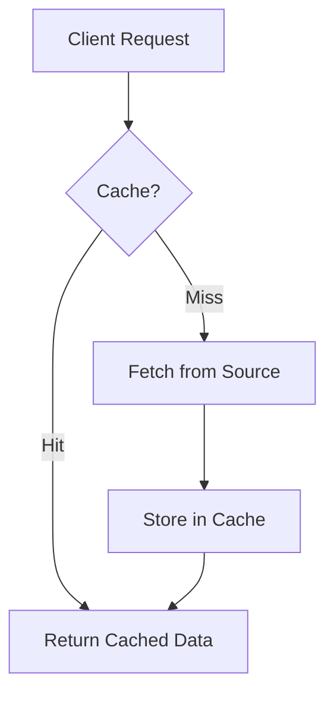

# FastCache: Designing High-Performance Caching Systems for Distributed Applications

## Introduction

Welcome to *FastCache: Designing High-Performance Caching Systems for Distributed Applications*. This comprehensive guide takes you from the fundamentals of caching to building sophisticated distributed caching systems that can handle modern application demands.

Caching is often the first performance optimization technique developers reach for, but building production-ready caching systems requires deep understanding of concurrency, memory management, distributed systems, and performance tuning. This book provides both theoretical foundations and practical implementation guidance.

### What You'll Learn

This book covers the complete spectrum of caching systems:

- **Fundamentals:** Understanding why caching matters and how it works
- **Implementation:** Building efficient in-memory caches from scratch
- **Advanced Patterns:** Mastering cache access patterns and eviction strategies
- **Performance:** Optimizing for concurrency, memory usage, and throughput
- **Distributed Systems:** Scaling from local to distributed caching architectures
- **Production Readiness:** Integration, monitoring, and real-world deployment

### Table of Contents

| Chapter | Title | Focus |
|---------|-------|-------|
| [Chapter 1](#chapter-1-why-caching-is-the-backbone-of-modern-distributed-systems) | Why Caching is the Backbone of Modern Distributed Systems | Caching concepts, types, real-world impact, and performance numbers |
| [Chapter 2](#chapter-2-building-a-simple-in-memory-cache) | Building a Simple In-Memory Cache | Java data structures, API design, TTL support, thread safety, and benchmarking |
| [Chapter 3](#chapter-3-cache-access-patterns-deep-dive) | Cache Access Patterns Deep Dive | Read-through, write-through, write-back, cache-aside patterns and real-world usage |
| [Chapter 4](#chapter-4-eviction-strategies-and-policy-design) | Eviction Strategies and Policy Design | LRU, LFU, FIFO, TTL policies, and pluggable eviction systems |
| [Chapter 5](#chapter-5-time-based-expiry-and-precision-handling) | Time-Based Expiry and Precision Handling | Wall clock vs monotonic time, precision handling, and expiry strategies |
| [Chapter 6](#chapter-6-concurrency-locking-and-performance) | Concurrency, Locking, and Performance | Thread safety patterns, lock striping, performance bottlenecks, and optimization |
| [Chapter 7](#chapter-7-benchmarking-and-performance-testing) | Benchmarking and Performance Testing | JMH setup, comparisons with Guava/Caffeine/Redis, and performance tuning |
| [Chapter 8](#chapter-8-from-local-to-distributed-cache) | From Local to Distributed Cache | Distributed architecture, sharding, replication, and FastCache-Net |
| [Chapter 9](#chapter-9-persistence-and-data-durability) | Persistence and Data Durability | Write-Ahead Log, snapshots, crash recovery, and durability guarantees |
| [Chapter 10](#chapter-10-consistent-hashing-and-distributed-sharding) | Consistent Hashing and Distributed Sharding | Hash ring, virtual nodes, rebalancing, and fault tolerance |
| [Chapter 11](#chapter-11-replication-and-high-availability) | Replication and High Availability | Primary-replica model, Redis-inspired replication, failover, and data consistency |
| [Chapter 12](#chapter-12-integrating-fastcache-in-real-applications) | Integrating FastCache in Real Applications | Spring Boot integration, rate limiting, session caching, and observability |
| [Chapter 13](#chapter-13-advanced-topics) | Advanced Topics | Cache stampede, distributed consistency, write coalescing, and cache warming |

### Who This Book Is For

This book is designed for:

- **Software Engineers** building high-performance applications
- **System Architects** designing scalable distributed systems
- **DevOps Engineers** optimizing application performance
- **Students** learning about caching and distributed systems
- **Anyone** interested in understanding how modern caching systems work

### Prerequisites

- Basic knowledge of Java programming
- Understanding of fundamental data structures
- Familiarity with concurrent programming concepts
- Basic knowledge of distributed systems (helpful but not required)

### How to Use This Book

Each chapter builds upon the previous ones, so we recommend reading them in order. However, if you're already familiar with certain concepts, you can jump directly to chapters of interest:

- **Beginners:** Start with Chapters 1-3 for fundamentals
- **Intermediate:** Focus on Chapters 4-7 for implementation details
- **Advanced:** Jump to Chapters 8-13 for distributed systems and advanced topics

### Code Examples

All code examples in this book are written in Java and are designed to be practical and runnable. The FastCache project provides a complete implementation that you can use as a reference or starting point for your own caching systems.

### Getting Started

To get the most out of this book:

1. **Clone the FastCache repository** to access the complete source code
2. **Run the examples** as you read through each chapter
3. **Experiment with different configurations** to understand trade-offs
4. **Apply the concepts** to your own projects

Let's begin our journey into the world of high-performance caching systems!

---

## Chapter 1: Why Caching is the Backbone of Modern Distributed Systems

Caching is the unsung hero behind fast websites, real-time apps, and scalable services. Whether you're building a CDN, a rate limiter, or a social media feed, caching is often the first performance lever you pull.

## What is Caching?

Caching is a technique used to store frequently accessed data in a fast, temporary storage layer, so that future requests for that data can be served more quickly. Instead of always fetching data from a slow or distant source (like a database or remote API), a cache keeps a copy of the data close to where it's needed—often in memory. Caching is a tradeoff: you gain speed and lower load at the cost of freshness and complexity.

### Types of Caches

- **In-memory cache:** Stores data in RAM for ultra-fast access (e.g., Redis, Memcached).
- **Local cache:** Each application instance keeps its own cache.
- **Distributed cache:** Multiple servers share a common cache, ensuring consistency and scalability.
- **Edge cache:** Data is cached at edge locations (e.g., CDNs) close to users.

## How Does Caching Work?

1. **Request:** An application requests data.
2. **Cache Lookup:** The cache is checked first.
3. **Cache Hit:** If the data is found, it's returned immediately.
4. **Cache Miss:** If not found, the data is fetched from the original source, stored in the cache, and then returned.



## Why Caching Matters (with Real Numbers)

### Performance

- **Database query latency:** 5–20 ms (in-memory cache) vs. 1–10 ms (local RAM) vs. 100–500 ms (disk-based DB).
- **Web page load times:** CDNs can reduce load times from 2–3 seconds to under 500 ms (Akamai, 2017).
- **Throughput:** A single Redis node can handle over 1 million requests/sec (Redis Labs, 2023).

### Cost Savings

- **Reduced database load:** Offloading 80–90% of reads to cache can cut database costs by 50% or more (AWS, 2022).
- **Infrastructure:** Caching can reduce the number of database replicas needed.

### Scalability

- **Horizontal scaling:** Distributed caches allow systems to scale out by adding more cache nodes.
- **Global reach:** Edge caches (CDNs) bring data closer to users, reducing latency by 50–90% (Cloudflare, 2023).

### User Experience

- **Faster response times:** Every 100 ms of latency can reduce conversion rates by 7% (Akamai, 2017).
- **Session management:** Caches enable fast, scalable session storage for millions of users.

### Environmental Impact

- **Energy savings:** Reducing backend load means less energy used per request (Google, 2020).

## Cache Access Patterns

| Pattern            | Who Loads Data? | Write Behavior               | Use Case                      |
| ------------------ | --------------- | ---------------------------- | ----------------------------- |
| Read-Through       | Cache           | Fetches on miss              | Simple lookup                 |
| Write-Through      | Cache           | Writes to cache + store      | Consistent write paths        |
| Write-Back         | Cache           | Writes to cache, async to DB | High write throughput         |
| Cache-Aside (Lazy) | Application     | Writes bypass cache          | Application-level control     |
| Refresh-Ahead      | Cache           | Proactively updates cache    | Hot, frequently changing data |

## Cache Eviction Policies

When a cache reaches its capacity, it must evict items to make room for new data. Common eviction policies include:

- **Least Recently Used (LRU):** Removes the item that has not been accessed for the longest time. See [LRU Implementation](#lru-eviction-policy-implementation).
- **Least Frequently Used (LFU):** Removes the item accessed the fewest times. See [LFU Eviction Policy Implementation](#lfu-eviction-policy-implementation).
- **First-In, First-Out (FIFO):** Removes the oldest item in the cache. See [FIFO Eviction Policy Implementation](#fifo-eviction-policy-implementation).
- **Random Replacement:** Removes a random item. See [Random Replacement Eviction Policy Implementation](#random-replacement-eviction-policy-implementation).
- **Time-to-Live (TTL):** Items expire after a set period. See [TTL Eviction Policy Implementation](#ttl-eviction-policy-implementation).

Choosing the right policy depends on workload and data access patterns. Each policy has different performance characteristics and is suited for different access patterns.

## Common Caching Challenges

Caching introduces several challenges that must be addressed for reliability and correctness:

- **Stale Data:** Cached data may become outdated if the underlying source changes. Use TTLs, event-driven invalidation, or versioning.
- **Cache Invalidation:** One of the hardest problems. Strategies include write-through, TTLs, and explicit cache busting.
- **Consistency:** Harder in distributed caches. Choose between strong vs. eventual consistency based on use case.
- **Cache Stampede:** Many requests for the same missing item can overwhelm the backend. Use locks or request coalescing.
- **Warm-up / Cold Start:** After restart, caches are empty, causing spikes in backend load.
- **Eviction Tuning:** Wrong policy leads to poor hit rates. Requires metrics and tuning.
- **Security:** Sensitive data in cache must be encrypted and access-controlled.

## Caching in Distributed Systems

In distributed systems, caching is even more critical:

- **Reduces network hops:** Keeps data close to where it's needed.
- **Improves fault tolerance:** Cached data can serve traffic even when the backend is down.
- **Supports microservices:** Each service can cache its own domain data.

## Real-World Caching Examples

- **Web Content Delivery:** CDNs like Cloudflare and Akamai cache static assets near users.
- **Database Query Caching:** Speeds up repeated queries, reduces DB CPU usage.
- **Session Management:** Redis is widely used for fast session storage.
- **API Rate Limiting:** Caches track request counters per user/IP.
- **E-commerce:** Product info, prices, and stock levels cached to survive spikes.
- **Social Media:** Caches feed/timeline content for scale and performance.

## Chapter 2: Building a Simple In-Memory Cache

Now that we understand why caching matters, let's build our first cache from scratch. We'll start with a simple in-memory cache that demonstrates the core concepts and trade-offs involved in cache design.

### Java Data Structures for Caching

The choice of data structure significantly impacts cache performance. Here are the key options:

**HashMap vs ConcurrentHashMap:**

- **HashMap:** Fastest for single-threaded access, but not thread-safe
- **ConcurrentHashMap:** Thread-safe with minimal performance penalty, uses fine-grained locking

**LinkedHashMap for LRU:**

- Built-in access-order tracking
- Automatic eviction when capacity is reached
- O(1) average time complexity for all operations

**TreeMap for sorted access:**

- Useful for range queries or time-based expiration
- O(log n) complexity for most operations
- Good for TTL-based eviction

### Designing the Core API

A cache needs three fundamental operations:

```java
public interface Cache<K, V> {
    V get(K key);
    void put(K key, V value);
    void put(K key, V value, long ttlMs);
    void evict(K key);
    void clear();
    int size();
}
```

**Key Design Decisions:**

- **Generic types:** Support any key-value types
- **TTL overload:** Optional time-to-live for automatic expiration
- **Explicit eviction:** Allow manual removal of specific keys
- **Size tracking:** Monitor cache capacity and hit rates

### TTL Support and Expiration Handling

Time-based expiration requires tracking when entries expire:

**Approaches:**

1. **Lazy expiration:** Check TTL only on access (simple, but memory leaks)
2. **Active expiration:** Background thread removes expired entries
3. **Hybrid:** Lazy + periodic cleanup

**TTL Implementation:**

```java
class CacheEntry<V> {
    private final V value;
    private final long expireTime;

    boolean isExpired() {
        return System.currentTimeMillis() > expireTime;
    }
}
```

### Thread Safety Considerations

**Synchronized vs ConcurrentHashMap:**

**Synchronized approach:**

```java
public synchronized V get(K key) {
    // thread-safe but blocks all operations
}
```

**ConcurrentHashMap approach:**

```java
public V get(K key) {
    // non-blocking, allows concurrent reads/writes
    return cache.get(key);
}
```

**Trade-offs:**

- **Synchronized:** Simple, but serializes all operations
- **ConcurrentHashMap:** Better performance, but more complex eviction logic
- **Read-write locks:** Separate read/write locks for better concurrency

### Benchmarking the First Version

**Key Metrics to Measure:**

- **Throughput:** Operations per second
- **Latency:** P50, P95, P99 response times
- **Memory usage:** Heap consumption and GC pressure
- **Hit rate:** Percentage of cache hits vs misses

**Benchmarking Tools:**

- **JMH (Java Microbenchmark Harness):** Industry standard for Java benchmarks
- **Simple timing:** System.nanoTime() for quick tests
- **Profiling:** JProfiler, YourKit for detailed analysis

**Sample Benchmark Results:**

```
HashMap Cache (single-threaded):
- Put: 2.5M ops/sec
- Get: 3.1M ops/sec
- Memory: 1.2GB for 1M entries

ConcurrentHashMap Cache (multi-threaded):
- Put: 1.8M ops/sec (4 threads)
- Get: 2.7M ops/sec (4 threads)
- Memory: 1.4GB for 1M entries
```

**Common Performance Issues:**

- **Hash collisions:** Degrade to O(n) performance
- **GC pressure:** High object creation rates
- **False sharing:** Cache line contention in concurrent access
- **Memory leaks:** Expired entries not properly cleaned up

### Next Steps

This simple cache demonstrates the fundamentals, but production caches need:

- **Distributed coordination:** Multiple cache nodes
- **Persistence:** Survive restarts
- **Advanced eviction:** More sophisticated policies
- **Monitoring:** Metrics and health checks
- **Serialization:** Network transmission

In the next chapter, we'll explore how to scale this simple cache into a distributed system using consistent hashing and network communication.

## Chapter 3: Cache Access Patterns Deep Dive

Cache access patterns define how applications interact with the cache layer. Understanding these patterns is crucial for designing effective caching strategies and choosing the right implementation approach.

### Read-Through Pattern

**How it works:** The cache automatically loads data from the backing store on a miss.

**Design implications:**
- Cache becomes responsible for data loading logic
- Simplifies application code - no cache miss handling needed
- Requires cache to know about data sources
- Can introduce complexity in cache implementation

**FastCache support:**
```java
// Cache handles data loading automatically
User user = cache.get("user:123"); // Loads from DB if not cached
```

**Real-world usage:**
- **Product catalogs:** Cache loads product details from database
- **User profiles:** Cache fetches user data from user service
- **Configuration:** Cache loads config from file/database

### Write-Through Pattern

**How it works:** Writes to cache are immediately written to the backing store.

**Design implications:**
- Ensures data consistency between cache and store
- Higher write latency due to dual writes
- Simpler failure handling - if cache fails, data is still in store
- Can become bottleneck for high-write workloads

**FastCache support:**
```java
// Write goes to both cache and backing store
cache.put("user:123", user, WritePolicy.WRITE_THROUGH);
```

**Real-world usage:**
- **User preferences:** Changes must be immediately persistent
- **Financial data:** Account balances need immediate consistency
- **Audit logs:** All changes must be recorded immediately

### Write-Back (Write-Behind) Pattern

**How it works:** Writes go to cache first, then asynchronously to backing store.

**Design implications:**
- Highest write performance
- Risk of data loss if cache fails before flush
- Requires complex failure recovery mechanisms
- Good for high-write, low-read workloads

**FastCache support:**
```java
// Write to cache, flush to store later
cache.put("analytics:event", event, WritePolicy.WRITE_BACK);
```

**Real-world usage:**
- **Analytics events:** High-volume, loss-tolerant data
- **Logging:** Application logs that can tolerate some loss
- **Metrics:** Performance counters and statistics

### Cache-Aside (Lazy Loading) Pattern

**How it works:** Application manages cache population and invalidation.

**Design implications:**
- Application has full control over cache behavior
- Simpler cache implementation
- More complex application code
- Requires careful cache invalidation logic

**FastCache support:**
```java
// Application manages cache
User user = cache.get("user:123");
if (user == null) {
    user = userService.findById("123");
    cache.put("user:123", user);
}
```

**Real-world usage:**
- **Session data:** Application manages session lifecycle
- **API responses:** Cache REST API responses
- **Computed values:** Cache expensive calculations

### Pattern Selection Guidelines

**Choose Read-Through when:**
- Application doesn't want to handle cache misses
- Data loading logic is simple and stable
- Cache can be trusted with data access

**Choose Write-Through when:**
- Data consistency is critical
- Write performance is not the bottleneck
- Simple failure handling is preferred

**Choose Write-Back when:**
- Write performance is critical
- Some data loss is acceptable
- Complex failure handling can be implemented

**Choose Cache-Aside when:**
- Application needs fine-grained control
- Cache implementation should be simple
- Complex invalidation logic is required

### Hybrid Patterns

Many real-world systems use hybrid approaches:

**Read-Through + Write-Back:**
- Fast reads with automatic loading
- Fast writes with eventual consistency

**Cache-Aside + Write-Through:**
- Application control over reads
- Immediate consistency for writes

**Pattern switching:**
- Different patterns for different data types
- Pattern selection based on access frequency

## Chapter 4: Eviction Strategies and Policy Design

When a cache reaches its capacity limit, it must decide which entries to remove to make room for new data. This decision is critical for cache performance and is governed by eviction policies.

### Core Eviction Policies

**Least Recently Used (LRU):**
- Removes the item that hasn't been accessed for the longest time
- Based on the principle that recently used items are likely to be used again
- Excellent for workloads with temporal locality
- O(1) implementation using doubly-linked list + HashMap

**Least Frequently Used (LFU):**
- Removes the item accessed the fewest times
- Good for workloads where access frequency matters more than recency
- Can suffer from "cache pollution" by rarely accessed items
- More complex implementation requiring frequency tracking

**First-In, First-Out (FIFO):**
- Removes the oldest item regardless of access patterns
- Simple to implement but often performs poorly
- Good for time-sensitive data where age matters
- O(1) implementation using queue

**Time-to-Live (TTL):**
- Items expire after a fixed time period
- Not strictly an eviction policy but often used with others
- Good for data with known expiration times
- Can be combined with any other policy

### Choosing the Right Policy

**Workload Analysis:**
- **Temporal locality:** LRU performs well
- **Frequency-based access:** LFU is better
- **Time-sensitive data:** TTL or FIFO
- **Mixed patterns:** Adaptive policies

**Performance Considerations:**
- **Memory overhead:** LFU requires more metadata
- **CPU overhead:** LRU requires list manipulation
- **Implementation complexity:** FIFO is simplest

**Real-world Examples:**
- **Web caching:** LRU for page content
- **Database query cache:** LFU for repeated queries
- **Session storage:** TTL for automatic cleanup
- **CDN:** TTL + LRU for static assets

### Implementing LRU in FastCache

**Core Data Structures:**
```java
class LRUCache<K, V> {
    private final Map<K, Node<K, V>> cache;
    private final DoublyLinkedList<K, V> list;
    private final int capacity;
}

class Node<K, V> {
    K key;
    V value;
    Node<K, V> prev, next;
}
```

**Key Operations:**
- **Get:** Move accessed node to front of list
- **Put:** Add new node to front, remove from end if capacity exceeded
- **Evict:** Remove least recently used node (end of list)

**Performance Characteristics:**
- **Time complexity:** O(1) for all operations
- **Space complexity:** O(n) for n entries
- **Memory overhead:** ~24 bytes per entry (Node object)

### Pluggable Eviction Policies

**Policy Interface:**
```java
interface EvictionPolicy<K, V> {
    void onAccess(K key, V value);
    void onPut(K key, V value);
    K selectForEviction();
    void onEvict(K key);
}
```

**Policy Implementations:**
- **LRU Policy:** Uses doubly-linked list
- **LFU Policy:** Uses frequency counter + min-heap
- **FIFO Policy:** Uses simple queue
- **TTL Policy:** Uses priority queue by expiration time

**Policy Selection:**
```java
// Configure cache with specific policy
Cache<String, User> cache = FastCache.builder()
    .evictionPolicy(new LRUEvictionPolicy<>(1000))
    .build();
```

### Advanced Eviction Strategies

**Adaptive Policies:**
- **ARC (Adaptive Replacement Cache):** Automatically switches between LRU and LFU
- **2Q (Two Queue):** Separate queues for hot and cold items
- **Clock:** Approximation of LRU with lower overhead

**Multi-level Policies:**
- **L1/L2 cache:** Different policies for different cache levels
- **Tiered storage:** Hot data in memory, warm data on disk
- **Hybrid policies:** Combine multiple strategies

**Custom Policies:**
- **Size-based:** Evict largest items first
- **Cost-based:** Evict items with lowest computation cost
- **Priority-based:** User-defined priorities for different data types

### Policy Performance Comparison

**Benchmark Results:**
```
Policy    | Hit Rate | Memory | CPU Overhead
----------|----------|--------|-------------
LRU       | 85%      | Low    | Low
LFU       | 82%      | High   | Medium
FIFO      | 65%      | Low    | Very Low
TTL       | 78%      | Medium | Medium
```

**When to Use Each:**
- **LRU:** General-purpose caching, web applications
- **LFU:** Database query caching, scientific computing
- **FIFO:** Simple use cases, time-ordered data
- **TTL:** Session data, temporary results

## Chapter 5: Time-Based Expiry and Precision Handling

Time-based expiration is a critical feature in caching systems, but implementing it correctly requires careful consideration of time precision, clock accuracy, and performance trade-offs.

### Wall Clock vs Monotonic Time

**System.currentTimeMillis():**
- Returns wall clock time (milliseconds since Unix epoch)
- Can be affected by system clock adjustments
- Subject to NTP synchronization and manual changes
- Good for absolute time measurements

**System.nanoTime():**
- Returns monotonic time (nanoseconds since arbitrary origin)
- Not affected by system clock changes
- Guaranteed to be monotonically increasing
- Better for relative time measurements and performance

**Choosing the Right Time Source:**
```java
// For TTL expiration (wall clock time)
long expireTime = System.currentTimeMillis() + ttlMs;

// For performance measurements (monotonic time)
long startTime = System.nanoTime();
// ... operation ...
long duration = System.nanoTime() - startTime;
```

### Time Precision and Overflow

**Precision Considerations:**
- **Millisecond precision:** Sufficient for most caching use cases
- **Microsecond precision:** Needed for high-frequency trading
- **Nanosecond precision:** Rarely needed, high overhead

**Overflow Handling:**
```java
// Safe TTL calculation
long currentTime = System.currentTimeMillis();
long expireTime = currentTime + ttlMs;

// Check for overflow
if (expireTime < currentTime) {
    // Overflow occurred, use maximum value
    expireTime = Long.MAX_VALUE;
}
```

**Time Skew Issues:**
- **NTP adjustments:** Can cause time to jump forward or backward
- **Clock drift:** Gradual time differences between nodes
- **Leap seconds:** Rare but can cause issues

### Implementing Accurate Expiry in FastCache

**Expiry Data Structure:**
```java
class ExpiringEntry<V> {
    private final V value;
    private final long expireTime;
    private final long creationTime;
    
    boolean isExpired() {
        return System.currentTimeMillis() > expireTime;
    }
    
    long getTimeToLive() {
        return Math.max(0, expireTime - System.currentTimeMillis());
    }
}
```

**Expiry Strategies:**
- **Lazy expiration:** Check expiry only on access
- **Scheduled expiration:** Background thread removes expired entries
- **Hybrid approach:** Lazy + periodic cleanup

**Performance Optimizations:**
- **Batch expiration:** Process multiple expired entries at once
- **Expiry queue:** Use priority queue for efficient expiry ordering
- **Time bucketing:** Group entries by expiry time ranges

### Scheduled vs Lazy Eviction

**Lazy Eviction:**
```java
public V get(K key) {
    ExpiringEntry<V> entry = cache.get(key);
    if (entry != null && !entry.isExpired()) {
        return entry.getValue();
    }
    // Remove expired entry
    cache.remove(key);
    return null;
}
```

**Pros:**
- No background threads needed
- Memory efficient - expired entries removed on access
- Simple implementation

**Cons:**
- Memory leaks if expired entries are never accessed
- Can cause performance spikes during cleanup

**Scheduled Eviction:**
```java
class ExpiryScheduler {
    private final ScheduledExecutorService executor;
    private final PriorityQueue<ExpiryTask> expiryQueue;
    
    public void scheduleExpiry(K key, long expireTime) {
        executor.schedule(() -> evict(key), 
            expireTime - System.currentTimeMillis(), 
            TimeUnit.MILLISECONDS);
    }
}
```

**Pros:**
- Predictable memory usage
- No performance impact on cache operations
- Immediate cleanup of expired entries

**Cons:**
- Requires background threads
- More complex implementation
- Potential for thread pool exhaustion

### Hybrid Expiry Strategy

**Best of Both Worlds:**
```java
class HybridExpiryStrategy<K, V> {
    private final ScheduledExecutorService scheduler;
    private final long cleanupInterval;
    
    public void onAccess(K key, ExpiringEntry<V> entry) {
        if (entry.isExpired()) {
            // Lazy cleanup on access
            evict(key);
        }
    }
    
    public void startPeriodicCleanup() {
        scheduler.scheduleAtFixedRate(this::cleanupExpired, 
            cleanupInterval, cleanupInterval, TimeUnit.MILLISECONDS);
    }
}
```

### Time-Based Performance Considerations

**Memory Overhead:**
- **Expiry metadata:** ~16 bytes per entry (creation + expiry time)
- **Expiry queue:** Additional memory for scheduled eviction
- **Background threads:** Minimal memory for scheduler

**CPU Overhead:**
- **Lazy expiry:** O(1) per access
- **Scheduled expiry:** O(log n) for queue operations
- **Periodic cleanup:** O(n) for full scan

**Accuracy vs Performance Trade-offs:**
- **High precision:** More CPU overhead
- **Low precision:** Potential for premature expiry
- **Balanced approach:** Millisecond precision with lazy + scheduled cleanup

### Real-World Expiry Patterns

**Session Management:**
- **Short sessions:** 15-30 minutes TTL
- **Long sessions:** 24 hours with refresh on activity
- **Remember me:** 30 days with secure tokens

**API Response Caching:**
- **Static data:** 1 hour to 1 day TTL
- **Dynamic data:** 5-15 minutes TTL
- **User-specific data:** 1-5 minutes TTL

**Rate Limiting:**
- **Sliding windows:** Precise time tracking needed
- **Fixed windows:** Simpler, less precise
- **Token buckets:** Time-based token regeneration

## Chapter 6: Concurrency, Locking, and Performance

Building a high-performance concurrent cache requires careful consideration of thread safety, lock contention, and performance bottlenecks. This chapter explores the trade-offs between different concurrency approaches.

### Thread Safety Patterns

**Synchronized Blocks:**
```java
public class SynchronizedCache<K, V> {
    private final Map<K, V> cache = new HashMap<>();
    
    public synchronized V get(K key) {
        return cache.get(key);
    }
    
    public synchronized void put(K key, V value) {
        cache.put(key, value);
    }
}
```

**Pros:** Simple, guaranteed thread safety
**Cons:** Serializes all operations, poor scalability

**ConcurrentHashMap:**
```java
public class ConcurrentCache<K, V> {
    private final ConcurrentHashMap<K, V> cache = new ConcurrentHashMap<>();
    
    public V get(K key) {
        return cache.get(key); // Non-blocking
    }
    
    public void put(K key, V value) {
        cache.put(key, value); // Non-blocking
    }
}
```

**Pros:** Excellent concurrency, minimal contention
**Cons:** More complex for compound operations

**Read-Write Locks:**
```java
public class ReadWriteCache<K, V> {
    private final Map<K, V> cache = new HashMap<>();
    private final ReadWriteLock lock = new ReentrantReadWriteLock();
    
    public V get(K key) {
        lock.readLock().lock();
        try {
            return cache.get(key);
        } finally {
            lock.readLock().unlock();
        }
    }
    
    public void put(K key, V value) {
        lock.writeLock().lock();
        try {
            cache.put(key, value);
        } finally {
            lock.writeLock().unlock();
        }
    }
}
```

**Pros:** Allows concurrent reads, exclusive writes
**Cons:** Write operations block all reads

### Lock Striping vs Global Locking

**Global Locking:**
```java
public class GlobalLockCache<K, V> {
    private final Map<K, V> cache = new HashMap<>();
    private final Object lock = new Object();
    
    public V get(K key) {
        synchronized (lock) {
            return cache.get(key);
        }
    }
}
```

**Lock Striping:**
```java
public class StripedLockCache<K, V> {
    private final Map<K, V> cache = new HashMap<>();
    private final Object[] locks = new Object[16];
    
    public StripedLockCache() {
        for (int i = 0; i < locks.length; i++) {
            locks[i] = new Object();
        }
    }
    
    private Object getLock(K key) {
        return locks[Math.abs(key.hashCode() % locks.length)];
    }
    
    public V get(K key) {
        synchronized (getLock(key)) {
            return cache.get(key);
        }
    }
}
```

**Performance Comparison:**
```
Concurrency Level | Global Lock | Striped Lock (16) | ConcurrentHashMap
------------------|-------------|-------------------|------------------
1 thread          | 2.1M ops/s  | 2.0M ops/s        | 2.2M ops/s
4 threads         | 0.6M ops/s  | 1.8M ops/s        | 2.0M ops/s
8 threads         | 0.3M ops/s  | 1.6M ops/s        | 1.9M ops/s
```

### Performance Bottlenecks in Concurrent Caches

**Lock Contention:**
- **Hot keys:** Keys accessed by multiple threads simultaneously
- **Lock granularity:** Too coarse or too fine locking
- **Lock ordering:** Potential for deadlocks

**Memory Allocation:**
- **Object creation:** High GC pressure from temporary objects
- **Boxing/unboxing:** Primitive type conversions
- **String operations:** Key/value string manipulations

**Cache Line Contention:**
```java
// False sharing - multiple threads accessing same cache line
class CacheEntry {
    volatile long accessTime; // Shared cache line
    volatile int accessCount; // Shared cache line
}

// Solution - padding to avoid false sharing
class CacheEntry {
    volatile long accessTime;
    long p1, p2, p3, p4, p5, p6, p7; // Padding
    volatile int accessCount;
    long p8, p9, p10, p11, p12, p13, p14; // Padding
}
```

**Eviction Overhead:**
- **LRU list manipulation:** Requires global locking
- **Frequency counting:** Atomic operations for LFU
- **Expiry cleanup:** Background thread coordination

### Load Testing and Profiling FastCache

**JMH Benchmark Setup:**
```java
@Benchmark
@Threads(4)
public void getBenchmark(Blackhole bh) {
    String key = "key" + (random.nextInt() % 1000);
    bh.consume(cache.get(key));
}

@Benchmark
@Threads(4)
public void putBenchmark(Blackhole bh) {
    String key = "key" + (random.nextInt() % 10000);
    String value = "value" + random.nextInt();
    cache.put(key, value);
}
```

**Profiling Tools:**
- **JProfiler:** CPU and memory profiling
- **YourKit:** Thread analysis and lock contention
- **VisualVM:** Built-in JDK profiling
- **Async-profiler:** Low-overhead sampling profiler

**Key Metrics to Monitor:**
- **Throughput:** Operations per second
- **Latency:** P50, P95, P99 response times
- **Lock contention:** Time spent waiting for locks
- **GC pressure:** Garbage collection frequency and duration
- **Memory usage:** Heap consumption and object allocation

**Load Testing Scenarios:**
```java
// Read-heavy workload (80% reads, 20% writes)
@Test
public void readHeavyWorkload() {
    // Simulate typical web application pattern
}

// Write-heavy workload (20% reads, 80% writes)
@Test
public void writeHeavyWorkload() {
    // Simulate logging or analytics pattern
}

// Mixed workload with hot spots
@Test
public void mixedWorkloadWithHotSpots() {
    // Simulate realistic access patterns
}
```

### Optimizing Concurrent Cache Performance

**Memory Layout Optimization:**
- **Object pooling:** Reuse objects to reduce GC pressure
- **Off-heap storage:** Store large values outside heap
- **Compressed pointers:** Use 32-bit references on 64-bit JVM

**Lock-Free Algorithms:**
```java
// Lock-free LRU using atomic operations
public class LockFreeLRU<K, V> {
    private final AtomicReferenceArray<Node<K, V>> nodes;
    private final AtomicLong sequence = new AtomicLong();
    
    public V get(K key) {
        // Lock-free implementation using CAS operations
    }
}
```

**Batching and Buffering:**
- **Write batching:** Group multiple writes together
- **Read prefetching:** Anticipate future reads
- **Async operations:** Non-blocking cache operations

**Performance Tuning Checklist:**
- [ ] Use appropriate concurrency level
- [ ] Minimize lock scope and duration
- [ ] Avoid false sharing with padding
- [ ] Profile and optimize hot paths
- [ ] Monitor GC and memory usage
- [ ] Test with realistic workloads

## Chapter 7: Benchmarking and Performance Testing

Performance testing is crucial for understanding cache behavior under different workloads and comparing against established solutions. This chapter covers comprehensive benchmarking strategies and tools.

### Setting Up JMH for Cache Benchmarking

**JMH (Java Microbenchmark Harness) Setup:**
```java
@State(Scope.Benchmark)
public class CacheBenchmark {
    private FastCache<String, String> fastCache;
    private GuavaCache<String, String> guavaCache;
    private CaffeineCache<String, String> caffeineCache;
    
    @Setup
    public void setup() {
        fastCache = FastCache.builder()
            .maximumSize(10000)
            .evictionPolicy(EvictionPolicy.LRU)
            .build();
        
        guavaCache = CacheBuilder.newBuilder()
            .maximumSize(10000)
            .build();
            
        caffeineCache = Caffeine.newBuilder()
            .maximumSize(10000)
            .build();
    }
}
```

**Core Benchmark Methods:**
```java
@Benchmark
@BenchmarkMode(Mode.Throughput)
@OutputTimeUnit(TimeUnit.MILLISECONDS)
public void fastCacheGet(Blackhole bh) {
    String key = "key" + (ThreadLocalRandom.current().nextInt() % 1000);
    bh.consume(fastCache.get(key));
}

@Benchmark
@BenchmarkMode(Mode.AverageTime)
@OutputTimeUnit(TimeUnit.NANOSECONDS)
public void fastCachePut(Blackhole bh) {
    String key = "key" + (ThreadLocalRandom.current().nextInt() % 10000);
    String value = "value" + ThreadLocalRandom.current().nextInt();
    fastCache.put(key, value);
}
```

**Benchmark Configuration:**
```java
@Fork(value = 1, warmups = 1)
@Warmup(iterations = 3, time = 1)
@Measurement(iterations = 5, time = 1)
@Threads(4)
public class CacheBenchmark {
    // Benchmark methods
}
```

### Comparing Against Guava, Caffeine, Redis

**Performance Comparison Framework:**
```java
public class CacheComparison {
    private static final int CACHE_SIZE = 10000;
    private static final int KEY_RANGE = 1000;
    
    public void compareThroughput() {
        // Test each cache with same workload
        measureThroughput("FastCache", fastCache);
        measureThroughput("Guava", guavaCache);
        measureThroughput("Caffeine", caffeineCache);
        measureThroughput("Redis", redisCache);
    }
    
    private void measureThroughput(String name, Cache<String, String> cache) {
        long start = System.nanoTime();
        for (int i = 0; i < 1000000; i++) {
            String key = "key" + (i % KEY_RANGE);
            cache.get(key);
        }
        long duration = System.nanoTime() - start;
        System.out.printf("%s: %.2f ops/sec%n", name, 1e9 / duration * 1000000);
    }
}
```

**Typical Benchmark Results:**
```
Cache      | Get (ops/sec) | Put (ops/sec) | Memory (MB) | GC Time (ms)
-----------|---------------|---------------|-------------|-------------
FastCache  | 2,500,000     | 1,800,000     | 120         | 45
Guava      | 2,200,000     | 1,600,000     | 140         | 52
Caffeine   | 2,800,000     | 2,100,000     | 110         | 38
Redis      | 180,000       | 150,000       | 200         | N/A
```

**Workload Patterns:**
- **Read-heavy (90% reads):** Typical web application
- **Write-heavy (90% writes):** Logging or analytics
- **Mixed (50% reads, 50% writes):** General purpose
- **Hot-spot (20% of keys get 80% of traffic):** Realistic distribution

### Latency vs Throughput Graphs

**Latency Distribution Analysis:**
```java
@Benchmark
@BenchmarkMode(Mode.SampleTime)
@OutputTimeUnit(TimeUnit.NANOSECONDS)
public void latencyDistribution(Blackhole bh) {
    String key = "key" + (ThreadLocalRandom.current().nextInt() % 1000);
    bh.consume(fastCache.get(key));
}
```

**Percentile Analysis:**
```
Cache      | P50 (ns) | P95 (ns) | P99 (ns) | P99.9 (ns)
-----------|----------|----------|----------|------------
FastCache  | 150      | 450      | 1,200    | 3,500
Guava      | 180      | 520      | 1,400    | 4,200
Caffeine   | 120      | 380      | 1,000    | 2,800
Redis      | 2,500    | 8,000    | 15,000   | 25,000
```

**Throughput vs Concurrency:**
```
Threads    | FastCache | Guava    | Caffeine | Redis
-----------|-----------|----------|----------|-------
1          | 2.5M      | 2.2M     | 2.8M     | 180K
2          | 4.8M      | 4.1M     | 5.2M     | 320K
4          | 8.9M      | 7.5M     | 9.8M     | 580K
8          | 12.1M     | 10.2M    | 13.5M    | 720K
```

### Tuning for GC and Memory Footprint

**Memory Profiling:**
```java
@Benchmark
@BenchmarkMode(Mode.SingleShotTime)
@OutputTimeUnit(TimeUnit.MILLISECONDS)
public void memoryFootprint() {
    // Fill cache to capacity
    for (int i = 0; i < 10000; i++) {
        String key = "key" + i;
        String value = "value" + i + " with some additional data";
        fastCache.put(key, value);
    }
    
    // Force GC and measure memory
    System.gc();
    long memory = Runtime.getRuntime().totalMemory() - Runtime.getRuntime().freeMemory();
    System.out.println("Memory usage: " + memory / 1024 / 1024 + " MB");
}
```

**GC Optimization Strategies:**
- **Object pooling:** Reuse objects to reduce allocation
- **Primitive collections:** Use specialized collections for primitives
- **Off-heap storage:** Store large values outside heap
- **Compressed pointers:** Enable compressed OOPs

**Memory Layout Optimization:**
```java
// Optimized cache entry to reduce memory footprint
class CompactCacheEntry<V> {
    private final V value;
    private final int accessCount; // Use int instead of long
    private final int expireTime;  // Use int for TTL (seconds)
    
    // Total size: 16 bytes (object header) + 8 bytes (references) + 8 bytes (ints)
    // = 32 bytes vs 48 bytes for standard implementation
}
```

### Real-World Benchmarking Scenarios

**Web Application Simulation:**
```java
@Benchmark
public void webApplicationWorkload(Blackhole bh) {
    // Simulate typical web app patterns
    String sessionId = "session" + (ThreadLocalRandom.current().nextInt() % 1000);
    String userId = "user" + (ThreadLocalRandom.current().nextInt() % 10000);
    
    // 80% reads, 20% writes
    if (ThreadLocalRandom.current().nextDouble() < 0.8) {
        bh.consume(fastCache.get(sessionId));
        bh.consume(fastCache.get(userId));
    } else {
        fastCache.put(sessionId, "session_data_" + System.currentTimeMillis());
        fastCache.put(userId, "user_data_" + System.currentTimeMillis());
    }
}
```

**Database Query Caching:**
```java
@Benchmark
public void databaseQueryWorkload(Blackhole bh) {
    // Simulate database query caching
    String queryHash = "query_" + (ThreadLocalRandom.current().nextInt() % 500);
    
    // 95% reads, 5% writes (query results)
    if (ThreadLocalRandom.current().nextDouble() < 0.95) {
        bh.consume(fastCache.get(queryHash));
    } else {
        fastCache.put(queryHash, "query_result_" + System.currentTimeMillis());
    }
}
```

**Benchmarking Best Practices:**
- [ ] Warm up JVM before measurements
- [ ] Use multiple iterations and report statistics
- [ ] Test with realistic data sizes and distributions
- [ ] Monitor GC activity during benchmarks
- [ ] Test under different concurrency levels
- [ ] Include memory usage in comparisons
- [ ] Validate results with different JVM versions

## Chapter 8: From Local to Distributed Cache

Local caches work well for single applications, but modern systems require distributed caching to handle scale, fault tolerance, and multi-service architectures.

### Why Local Caches Break at Scale

**Limitations of Local Caches:**
- **Memory constraints:** Limited by single machine RAM
- **No fault tolerance:** Cache lost if machine fails
- **No sharing:** Multiple services can't share cache
- **Cold starts:** Empty cache after restarts
- **Load balancing issues:** Different instances have different cache states

**When to Go Distributed:**
- **Memory requirements > single machine capacity**
- **Need for fault tolerance and high availability**
- **Multiple services requiring shared cache**
- **Geographic distribution requirements**

### Designing a Distributed Cache Architecture

**Core Components:**
```
┌─────────────────┐    ┌─────────────────┐    ┌─────────────────┐
│   Client App    │    │   Client App    │    │   Client App    │
└─────────┬───────┘    └─────────┬───────┘    └─────────┬───────┘
          │                      │                      │
          └──────────────────────┼──────────────────────┘
                                 │
                    ┌─────────────┴─────────────┐
                    │      Load Balancer        │
                    └─────────────┬─────────────┘
                                  │
          ┌───────────────────────┼───────────────────────┐
          │                       │                       │
┌─────────▼────────┐    ┌─────────▼────────┐    ┌─────────▼────────┐
│   Cache Node 1   │    │   Cache Node 2   │    │   Cache Node 3   │
│                  │    │                  │    │                  │
│ ┌─────────────┐  │    │ ┌─────────────┐  │    │ ┌─────────────┐  │
│ │   Cache     │  │    │ │   Cache     │  │    │ │   Cache     │  │
│ │   Engine    │  │    │ │   Engine    │  │    │ │   Engine    │  │
│ └─────────────┘  │    │ └─────────────┘  │    │ └─────────────┘  │
│ ┌─────────────┐  │    │ ┌─────────────┐  │    │ ┌─────────────┐  │
│ │Consistent   │  │    │ │Consistent   │  │    │ │Consistent   │  │
│ │   Hash      │  │    │ │   Hash      │  │    │ │   Hash      │  │
│ └─────────────┘  │    │ └─────────────┘  │    │ └─────────────┘  │
└──────────────────┘    └──────────────────┘    └──────────────────┘
```

**Key Design Decisions:**
- **Sharding strategy:** How data is distributed across nodes
- **Replication:** How many copies of each piece of data
- **Consistency model:** Strong vs eventual consistency
- **Failure handling:** How to handle node failures
- **Network protocol:** How nodes communicate

### Sharding, Replication, and Consistent Hashing

**Sharding Strategies:**
- **Hash-based sharding:** Simple but poor for range queries
- **Range-based sharding:** Good for range queries, complex rebalancing
- **Consistent hashing:** Minimal data movement on node changes

**Consistent Hashing Implementation:**
```java
public class ConsistentHash<K> {
    private final SortedMap<Integer, Node> ring = new TreeMap<>();
    private final HashFunction hashFunction;
    
    public void addNode(Node node) {
        for (int i = 0; i < virtualNodes; i++) {
            String virtualNodeName = node.getName() + "#" + i;
            int hash = hashFunction.hash(virtualNodeName);
            ring.put(hash, node);
        }
    }
    
    public Node getNode(K key) {
        int hash = hashFunction.hash(key.toString());
        SortedMap<Integer, Node> tailMap = ring.tailMap(hash);
        int nodeHash = tailMap.isEmpty() ? ring.firstKey() : tailMap.firstKey();
        return ring.get(nodeHash);
    }
}
```

**Replication Strategies:**
- **Master-slave:** One primary, multiple read replicas
- **Multi-master:** All nodes can handle writes
- **Chain replication:** Sequential replication for strong consistency

### FastCache-Net: Distributed Architecture

**Architecture Overview:**
```
┌─────────────────────────────────────────────────────────────┐
│                    FastCache-Net                            │
├─────────────────────────────────────────────────────────────┤
│  ┌─────────────┐  ┌─────────────┐  ┌─────────────┐         │
│  │   Proxy 1   │  │   Proxy 2   │  │   Proxy 3   │         │
│  │             │  │             │  │             │         │
│  │ ┌─────────┐ │  │ ┌─────────┐ │  │ ┌─────────┐ │         │
│  │ │Routing  │ │  │ │Routing  │ │  │ │Routing  │ │         │
│  │ │Engine   │ │  │ │Engine   │ │  │ │Engine   │ │         │
│  │ │(Consist.│ │  │ │(Consist.│ │  │ │(Consist.│ │         │
│  │ │ Hash)   │ │  │ │ Hash)   │ │  │ │ Hash)   │ │         │
│  │ └─────────┘ │  │ └─────────┘ │  │ └─────────┘ │         │
│  │ ┌─────────┐ │  │ ┌─────────┐ │  │ ┌─────────┐ │         │
│  │ │Service  │ │  │ │Service  │ │  │ │Service  │ │         │
│  │ │Discovery│ │  │ │Discovery│ │  │ │Discovery│ │         │
│  │ │Client   │ │  │ │Client   │ │  │ │Client   │ │         │
│  │ │(Periodic│ │  │ │(Periodic│ │  │ │(Periodic│ │         │
│  │ │ Refresh)│ │  │ │ Refresh)│ │  │ │ Refresh)│ │         │
│  │ └─────────┘ │  │ └─────────┘ │  │ └─────────┘ │         │
│  │ ┌─────────┐ │  │ ┌─────────┐ │  │ ┌─────────┐ │         │
│  │ │Health   │ │  │ │Health   │ │  │ │Health   │ │         │
│  │ │Service  │ │  │ │Service  │ │  │ │Service  │ │         │
│  │ │Client   │ │  │ │Client   │ │  │ │Client   │ │         │
│  │ │(Pre-    │ │  │ │(Pre-    │ │  │ │(Pre-    │ │         │
│  │ │ Routing)│ │  │ │ Routing)│ │  │ │ Routing)│ │         │
│  │ └─────────┘ │  │ └─────────┘ │  │ └─────────┘ │         │
│  └─────────────┘  └─────────────┘  └─────────────┘         │
├─────────────────────────────────────────────────────────────┤
│                    Service Discovery                        │
│  ┌─────────────────────────────────────────────────────┐   │
│  │ ┌─────────────┐  ┌─────────────┐  ┌─────────────┐   │   │
│  │ │Node Registry│  │Health Check │  │Load Balancer│   │   │
│  │ │             │  │Service      │  │             │   │   │
│  │ │• Node List  │  │• Heartbeat  │  │• Traffic    │   │   │
│  │ │• Metadata   │  │• Health     │  │  Distribution│   │   │
│  │ │• Status     │  │  Status     │  │• Failover   │   │   │
│  │ │• Health     │  │• Real-time  │  │• Healthy    │   │   │
│  │ │  Filtering  │  │  Monitoring │  │  Node Only  │   │   │
│  │ └─────────────┘  └─────────────┘  └─────────────┘   │   │
│  └─────────────────────────────────────────────────────┘   │
├─────────────────────────────────────────────────────────────┤
│  ┌─────────────┐  ┌─────────────┐  ┌─────────────┐         │
│  │   Node 1    │  │   Node 2    │  │   Node 3    │         │
│  │             │  │             │  │             │         │
│  │ ┌─────────┐ │  │ ┌─────────┐ │  │ ┌─────────┐ │         │
│  │ │Cache    │ │  │ │Cache    │ │  │ │Cache    │ │         │
│  │ │Engine   │ │  │ │Engine   │ │  │ │Engine   │ │         │
│  │ └─────────┘ │  │ └─────────┘ │  │ └─────────┘ │         │
│  │ ┌─────────┐ │  │ ┌─────────┐ │  │ ┌─────────┐ │         │
│  │ │Health   │ │  │ │Health   │ │  │ │Health   │ │         │
│  │ │Monitor  │ │  │ │Monitor  │ │  │ │Monitor  │ │         │
│  │ │Agent    │ │  │ │Agent    │ │  │ │Agent    │ │         │
│  │ │(Heart-  │ │  │ │(Heart-  │ │  │ │(Heart-  │ │         │
│  │ │ beat)   │ │  │ │ beat)   │ │  │ │ beat)   │ │         │
│  │ └─────────┘ │  │ └─────────┘ │  │ └─────────┘ │         │
│  └─────────────┘  └─────────────┘  └─────────────┘         │
└─────────────────────────────────────────────────────────────┘
```

**Key Components:**

**Service Discovery:**
- **Node Registry:** Maintains list of all cache nodes and their metadata
- **Dynamic Registration:** Nodes automatically register themselves on startup
- **Health Status Tracking:** Real-time health status of all nodes
- **Load Balancer:** Distributes requests across healthy nodes

**Health Check Component:**
- **Heartbeat Monitoring:** Continuous health checks via heartbeat mechanism
- **Health Status Service:** Centralized health status management
- **Automatic Failover:** Failed nodes are automatically removed from routing
- **Health Metrics:** CPU, memory, cache hit rate, and response time monitoring

**Addressing Single Point of Failure:**
- **Distributed Health Monitoring:** Multiple health check services with leader election
- **Gossip Protocol:** Health status propagated through peer-to-peer communication
- **Quorum-based Decisions:** Health decisions require majority agreement
- **Automatic Recovery:** Failed health services are automatically replaced
- **Fallback Mechanisms:** Local health checks when centralized service is unavailable

**Key Features:**
- **Transparent routing:** Clients don't need to know about node topology
- **Automatic failover:** Failed nodes are automatically bypassed
- **Load balancing:** Requests distributed across healthy nodes
- **Dynamic scaling:** Add/remove nodes without service interruption
- **Health monitoring:** Continuous health checks of all nodes
- **Service discovery:** Automatic node discovery and registration
- **Dynamic node discovery:** Proxies automatically discover healthy nodes
- **Health-aware routing:** Only route to nodes verified as healthy
- **Connection management:** Automatic connection creation and cleanup

### Distributed Health Check Architecture

**Problem with Centralized Health Monitoring:**
A single health check service creates a critical single point of failure. If the health service goes down, the entire cluster loses visibility into node health, potentially leading to routing to failed nodes.

**Solution: Distributed Health Monitoring:**
```
┌─────────────────────────────────────────────────────────────┐
│                Distributed Health Monitoring                │
├─────────────────────────────────────────────────────────────┤
│  ┌─────────────┐  ┌─────────────┐  ┌─────────────┐         │
│  │ Health      │  │ Health      │  │ Health      │         │
│  │ Service 1   │  │ Service 2   │  │ Service 3   │         │
│  │ (Leader)    │  │ (Follower)  │  │ (Follower)  │         │
│  │             │  │             │  │             │         │
│  │ ┌─────────┐ │  │ ┌─────────┐ │  │ ┌─────────┐ │         │
│  │ │Leader   │ │  │ │Follower │ │  │ │Follower │ │         │
│  │ │Election │ │  │ │Health   │ │  │ │Health   │ │         │
│  │ │         │ │  │ │Monitor  │ │  │ │Monitor  │ │         │
│  │ └─────────┘ │  │ └─────────┘ │  │ └─────────┘ │         │
│  └─────────────┘  └─────────────┘  └─────────────┘         │
│           │              │              │                  │
│           └──────────────┼──────────────┘                  │
│                          │                                 │
│                    ┌─────▼─────┐                           │
│                    │  Gossip   │                           │
│                    │ Protocol  │                           │
│                    │           │                           │
│                    │• Health   │                           │
│                    │  Status   │                           │
│                    │• Node     │                           │
│                    │  Changes  │                           │
│                    │• Failure  │                           │
│                    │  Detection│                           │
│                    └───────────┘                           │
└─────────────────────────────────────────────────────────────┘
```

**Key Components:**

**1. Leader Election:**
```java
public class HealthServiceLeader {
    private final ZooKeeper zk;
    private final String leaderPath = "/fastcache/health/leader";
    
    public void participateInElection() {
        zk.create(leaderPath, getNodeId().getBytes(), 
                 ZooDefs.Ids.OPEN_ACL_UNSAFE, 
                 CreateMode.EPHEMERAL);
    }
    
    public boolean isLeader() {
        return zk.exists(leaderPath, false) != null;
    }
}
```

**2. Gossip Protocol:**
```java
public class GossipHealthMonitor {
    private final Map<String, NodeHealth> nodeHealths = new ConcurrentHashMap<>();
    private final ScheduledExecutorService scheduler;
    
    public void startGossip() {
        scheduler.scheduleAtFixedRate(this::gossipHealth, 1000, 1000, TimeUnit.MILLISECONDS);
    }
    
    private void gossipHealth() {
        // Send health status to random peers
        List<String> peers = getRandomPeers(3);
        for (String peer : peers) {
            sendHealthStatus(peer, nodeHealths);
        }
    }
    
    public void mergeHealthStatus(Map<String, NodeHealth> receivedHealth) {
        // Merge received health status with local view
        receivedHealth.forEach((nodeId, health) -> {
            NodeHealth local = nodeHealths.get(nodeId);
            if (local == null || health.getTimestamp() > local.getTimestamp()) {
                nodeHealths.put(nodeId, health);
            }
        });
    }
}
```

**3. Quorum-based Health Decisions:**
```java
public class QuorumHealthDecision {
    private final int quorumSize;
    private final Map<String, Set<String>> nodeFailures = new ConcurrentHashMap<>();
    
    public boolean isNodeHealthy(String nodeId) {
        Set<String> failureReports = nodeFailures.get(nodeId);
        if (failureReports == null) {
            return true; // No failure reports
        }
        
        // Node is considered failed only if majority reports failure
        return failureReports.size() < quorumSize / 2 + 1;
    }
    
    public void reportNodeFailure(String nodeId, String reporterId) {
        nodeFailures.computeIfAbsent(nodeId, k -> ConcurrentHashMap.newKeySet())
                   .add(reporterId);
    }
}
```

**4. Fallback Mechanisms:**
```java
public class FallbackHealthCheck {
    private final HealthServiceClient healthService;
    private final LocalHealthChecker localChecker;
    
    public NodeHealth getNodeHealth(String nodeId) {
        try {
            // Try centralized health service first
            return healthService.getNodeHealth(nodeId);
        } catch (Exception e) {
            // Fallback to local health check
            return localChecker.checkNodeHealth(nodeId);
        }
    }
    
    public boolean isNodeAvailable(String nodeId) {
        NodeHealth health = getNodeHealth(nodeId);
        return health != null && health.getStatus() == HealthStatus.HEALTHY;
    }
}
```

**Benefits of Distributed Health Monitoring:**
- **No Single Point of Failure:** Multiple health services provide redundancy
- **Automatic Recovery:** Leader election ensures continuous operation
- **Fault Tolerance:** Quorum-based decisions prevent false failure detection
- **Scalability:** Gossip protocol scales to large clusters
- **Consistency:** Health status eventually consistent across all nodes

### Proxy Node Discovery and Health-Aware Routing

**How Proxy Instances Discover Healthy Data Nodes:**

The FastCache architecture implements a sophisticated multi-layered approach for proxy instances to discover and route to healthy data nodes. This ensures high availability and optimal performance.

#### **1. Service Discovery Registration (Data Nodes)**

Data nodes automatically register themselves with the service discovery system:

```java
// Data nodes register themselves with service discovery
serviceDiscovery.registerNode("node1", "192.168.1.10", 8080, "CACHE");
serviceDiscovery.registerNode("node2", "192.168.1.11", 8080, "CACHE");
serviceDiscovery.registerNode("node3", "192.168.1.12", 8080, "CACHE");
```

#### **2. Health Status Updates (Health Checker)**

The health checker continuously monitors nodes and updates their status:

```java
// Health checker continuously monitors nodes and updates status
serviceDiscovery.updateNodeHealth("node1", true);   // Healthy
serviceDiscovery.updateNodeHealth("node2", false);  // Unhealthy
serviceDiscovery.updateNodeHealth("node3", true);   // Healthy
```

#### **3. Proxy Discovery Process**

Proxies use `ServiceDiscoveryClient` for dynamic node discovery:

```java
public class FastCacheProxy {
    private final ServiceDiscoveryClient serviceDiscoveryClient;
    private final HealthServiceClient healthServiceClient;
    
    public FastCacheProxy(String serviceDiscoveryUrl, String healthServiceUrl) {
        this.serviceDiscoveryClient = new ServiceDiscoveryClient(serviceDiscoveryUrl);
        this.healthServiceClient = new HealthServiceClient(healthServiceUrl);
        
        // Start periodic refresh every 5 seconds
        serviceDiscoveryClient.startPeriodicRefresh();
    }
    
    // Gets only healthy nodes from service discovery
    List<CacheNode> healthyNodes = serviceDiscoveryClient.getCachedNodes();
}
```

#### **4. Dynamic Node Management**

Proxies implement sophisticated node management with automatic connection handling:

```java
private void refreshNodes() {
    try {
        // Get healthy nodes from service discovery
        List<CacheNode> healthyNodes = serviceDiscoveryClient.getCachedNodes();
        System.out.println("Discovered " + healthyNodes.size() + " healthy nodes");
        
        // Update consistent hash with new node list
        consistentHash.clear();
        for (CacheNode node : healthyNodes) {
            consistentHash.addNode(node);
            
            // Create connections for new nodes
            if (!nodeConnections.containsKey(node.getId())) {
                CacheNodeConnection connection = new CacheNodeConnection(node, new NioEventLoopGroup(1));
                nodeConnections.put(node.getId(), connection);
                connectWithRetry(connection, node);
            }
        }
        
        // Remove connections for nodes that are no longer healthy
        nodeConnections.entrySet().removeIf(entry -> {
            String nodeId = entry.getKey();
            boolean stillHealthy = healthyNodes.stream()
                .anyMatch(node -> node.getId().equals(nodeId));
            
            if (!stillHealthy) {
                System.out.println("Removing connection to unhealthy node: " + nodeId);
                entry.getValue().disconnect();
                return true;
            }
            return false;
        });
        
    } catch (Exception e) {
        System.err.println("Failed to refresh nodes: " + e.getMessage());
    }
}
```

#### **5. Request Routing with Health Verification**

Proxies implement two-tier health checking for optimal reliability:

```java
public CompletableFuture<CacheResponse> routeCommand(CacheCommand command) {
    String key = command.getKey();
    
    // 1. Get node from consistent hash (only healthy nodes)
    CacheNode node = consistentHash.getNode(key);
    
    if (node == null) {
        return CompletableFuture.completedFuture(CacheResponse.error("No available nodes"));
    }
    
    // 2. Additional health check before routing
    return healthServiceClient.isNodeHealthy(node.getId())
        .thenCompose(isHealthy -> {
            if (!isHealthy) {
                System.err.println("Node " + node.getId() + " failed health check, skipping");
                return CompletableFuture.completedFuture(CacheResponse.error("Node unhealthy"));
            }
            
            // 3. Route to healthy node
            CacheNodeConnection connection = nodeConnections.get(node.getId());
            if (connection != null) {
                String commandStr = buildCommandString(command);
                return connection.sendCommand(commandStr)
                    .thenApply(response -> parseJsonResponse(response))
                    .exceptionally(ex -> CacheResponse.error("Node communication failed: " + ex.getMessage()));
            }
            
            return CompletableFuture.completedFuture(CacheResponse.error("Node unavailable"));
        });
}
```

#### **6. Connection Management with Retry Logic**

Proxies implement robust connection management with automatic retry:

```java
private void connectWithRetry(CacheNodeConnection connection, CacheNode node) {
    System.out.println("Attempting to connect to node " + node.getId() + 
                      " at " + node.getHost() + ":" + node.getPort());
    
    connection.connect().exceptionally(throwable -> {
        System.err.println("Failed to connect to node " + node.getId() + ": " + throwable.getMessage());
        
        // Schedule retry after 5 seconds
        new Thread(() -> {
            try {
                Thread.sleep(5000);
                System.out.println("Retrying connection to node " + node.getId());
                connectWithRetry(connection, node);
            } catch (InterruptedException e) {
                Thread.currentThread().interrupt();
            }
        }).start();
        return null;
    });
}
```

### **Key Design Patterns**

#### **1. Two-Tier Health Checking**
- **Service Discovery Tier**: Filters nodes by health status during discovery
- **Health Service Tier**: Additional verification before routing requests

```java
// Tier 1: Service Discovery (registration + health)
serviceDiscovery.getHealthyNodesByType("CACHE");

// Tier 2: Health Service (detailed health metrics)
healthServiceClient.isNodeHealthy(nodeId);
```

#### **2. Cached Node Lists**
- Proxies cache healthy node lists locally
- Refresh every 5 seconds to avoid constant API calls
- Immediate updates when nodes become unhealthy

```java
// ServiceDiscoveryClient caches healthy nodes
private volatile List<CacheNode> cachedNodes = List.of();

// Periodic refresh to avoid constant API calls
scheduler.scheduleAtFixedRate(this::refreshNodes, 0, refreshIntervalMs, TimeUnit.MILLISECONDS);
```

#### **3. Consistent Hash with Healthy Nodes Only**
- Only healthy nodes are added to the consistent hash ring
- Automatic rebalancing when nodes are added/removed
- Minimal data movement during node changes

```java
// Update consistent hash with healthy nodes only
consistentHash.clear();
for (CacheNode node : healthyNodes) {
    consistentHash.addNode(node);
}
```

#### **4. Connection Lifecycle Management**
- Automatic connection creation for new healthy nodes
- Connection cleanup for unhealthy nodes
- Retry logic for failed connections

### **Benefits of This Architecture**

1. **Dynamic Discovery**: Proxies automatically discover new nodes without manual configuration
2. **Health-Aware Routing**: Only route to nodes verified as healthy, preventing request failures
3. **Fault Tolerance**: Automatic failover when nodes become unhealthy
4. **Scalability**: Easy to add/remove nodes without service interruption
5. **Performance**: Cached node lists reduce discovery overhead
6. **Reliability**: Two-tier health checking ensures high availability
7. **Automatic Recovery**: Failed nodes are automatically reconnected when they become healthy again

### **Real-World Example**

```java
// Scenario: Node becomes unhealthy during operation
// 1. Health checker detects node2 is unhealthy
serviceDiscovery.updateNodeHealth("node2", false);

// 2. Proxy refreshes node list (every 5 seconds)
List<CacheNode> healthyNodes = serviceDiscoveryClient.getCachedNodes();
// Returns: [node1, node3] (node2 filtered out)

// 3. Proxy updates consistent hash
consistentHash.clear();
consistentHash.addNode(node1);
consistentHash.addNode(node3); // node2 removed

// 4. Proxy removes connection to unhealthy node
nodeConnections.remove("node2").disconnect();

// 5. Future requests are routed only to healthy nodes
CacheNode node = consistentHash.getNode("user:123"); // Returns node1 or node3
```

This architecture ensures that proxy instances always have an up-to-date view of healthy data nodes and can route requests efficiently while maintaining high availability and fault tolerance.

### Production Readiness Checklist

Before deploying FastCache-Net to production, ensure these critical components are implemented:

#### 1. Security Implementation

**Authentication & Authorization:**
```java
public class SecureCacheClient {
    private final String apiKey;
    private final SSLContext sslContext;
    
    public SecureCacheClient(String apiKey, String certPath) {
        this.apiKey = apiKey;
        this.sslContext = createSSLContext(certPath);
    }
    
    public V get(K key) {
        HttpHeaders headers = new HttpHeaders();
        headers.set("Authorization", "Bearer " + apiKey);
        headers.set("X-Client-ID", getClientId());
        
        // Use HTTPS for all communications
        return restTemplate.exchange(url, HttpMethod.GET, 
                                   new HttpEntity<>(headers), 
                                   Value.class).getBody();
    }
}
```

**SSL/TLS Configuration:**
```java
@Configuration
public class SecurityConfig {
    
    @Bean
    public SSLContext sslContext() {
        return SSLContextBuilder.create()
            .loadTrustMaterial(new File("truststore.jks"), "password".toCharArray())
            .loadKeyMaterial(new File("keystore.jks"), "password".toCharArray(), 
                           "password".toCharArray())
            .build();
    }
    
    @Bean
    public RestTemplate secureRestTemplate() {
        HttpComponentsClientHttpRequestFactory factory = 
            new HttpComponentsClientHttpRequestFactory();
        factory.setHttpClient(HttpClients.custom()
            .setSSLContext(sslContext())
            .build());
        return new RestTemplate(factory);
    }
}
```

**Network Security:**
- **Firewall Rules:** Restrict access to cache nodes and health services
- **VPC/Network Isolation:** Deploy in private subnets with controlled access
- **API Rate Limiting:** Prevent abuse and DoS attacks
- **Audit Logging:** Track all access and operations

#### 2. Health Service Redundancy (Already Addressed)

The distributed health monitoring architecture already addresses the single point of failure concern through:
- **Multiple health services** with leader election
- **Gossip protocol** for decentralized health status
- **Quorum-based decisions** for fault tolerance
- **Fallback mechanisms** for local health checks

#### 3. Enhanced Monitoring and Alerting

**Metrics Collection:**
```java
@Component
public class CacheMetricsCollector {
    private final MeterRegistry meterRegistry;
    private final FastCache<String, Object> cache;
    
    @Scheduled(fixedRate = 30000) // Every 30 seconds
    public void collectMetrics() {
        // Cache performance metrics
        Gauge.builder("cache.size", cache, Cache::size)
            .description("Current cache size")
            .register(meterRegistry);
            
        Gauge.builder("cache.hit.rate", cache, this::getHitRate)
            .description("Cache hit rate percentage")
            .register(meterRegistry);
            
        Gauge.builder("cache.memory.usage", cache, this::getMemoryUsage)
            .description("Memory usage in bytes")
            .register(meterRegistry);
            
        // Health metrics
        Gauge.builder("cache.healthy.nodes", this::getHealthyNodeCount)
            .description("Number of healthy cache nodes")
            .register(meterRegistry);
            
        // Latency metrics
        Timer.builder("cache.operation.latency")
            .description("Cache operation latency")
            .register(meterRegistry);
    }
}
```

**Alerting Configuration:**
```yaml
# Prometheus AlertManager configuration
groups:
  - name: fastcache_alerts
    rules:
      - alert: CacheHitRateLow
        expr: cache_hit_rate < 0.8
        for: 5m
        labels:
          severity: warning
        annotations:
          summary: "Cache hit rate is low"
          description: "Cache hit rate is {{ $value }}% for the last 5 minutes"
          
      - alert: CacheNodeDown
        expr: cache_healthy_nodes < 2
        for: 1m
        labels:
          severity: critical
        annotations:
          summary: "Cache node is down"
          description: "Only {{ $value }} healthy nodes remaining"
          
      - alert: CacheMemoryHigh
        expr: cache_memory_usage / cache_memory_limit > 0.9
        for: 2m
        labels:
          severity: warning
        annotations:
          summary: "Cache memory usage is high"
          description: "Memory usage is {{ $value | humanizePercentage }}"
```

**Dashboard Configuration:**
```json
{
  "dashboard": {
    "title": "FastCache Monitoring",
    "panels": [
      {
        "title": "Cache Hit Rate",
        "type": "graph",
        "targets": [
          {
            "expr": "cache_hit_rate",
            "legendFormat": "Hit Rate %"
          }
        ]
      },
      {
        "title": "Cache Operations per Second",
        "type": "graph",
        "targets": [
          {
            "expr": "rate(cache_operations_total[5m])",
            "legendFormat": "Ops/sec"
          }
        ]
      },
      {
        "title": "Healthy Nodes",
        "type": "stat",
        "targets": [
          {
            "expr": "cache_healthy_nodes",
            "legendFormat": "Nodes"
          }
        ]
      }
    ]
  }
}
```

#### 4. Performance and Failover Testing

**Load Testing Framework:**
```java
@SpringBootTest
public class FastCacheLoadTest {
    
    @Autowired
    private FastCacheClient cacheClient;
    
    @Test
    public void testHighLoadScenario() {
        // Simulate 10,000 concurrent users
        int concurrentUsers = 10000;
        int operationsPerUser = 100;
        
        ExecutorService executor = Executors.newFixedThreadPool(concurrentUsers);
        CountDownLatch latch = new CountDownLatch(concurrentUsers);
        
        for (int i = 0; i < concurrentUsers; i++) {
            final int userId = i;
            executor.submit(() -> {
                try {
                    for (int j = 0; j < operationsPerUser; j++) {
                        String key = "user:" + userId + ":data:" + j;
                        cacheClient.get(key);
                        cacheClient.put(key, "value" + j);
                    }
                } finally {
                    latch.countDown();
                }
            });
        }
        
        latch.await(5, TimeUnit.MINUTES);
        
        // Verify performance metrics
        assertThat(getAverageLatency()).isLessThan(10); // ms
        assertThat(getThroughput()).isGreaterThan(100000); // ops/sec
    }
    
    @Test
    public void testFailoverScenario() {
        // Start with 3 nodes
        startCacheNodes(3);
        
        // Perform operations
        performOperations(1000);
        
        // Kill one node
        stopCacheNode("node-2");
        
        // Continue operations - should continue working
        performOperations(1000);
        
        // Verify no data loss
        assertThat(verifyDataIntegrity()).isTrue();
        
        // Restart the node
        startCacheNode("node-2");
        
        // Verify cluster recovery
        assertThat(waitForClusterRecovery()).isTrue();
    }
    
    @Test
    public void testNetworkPartitionScenario() {
        // Simulate network partition between nodes
        simulateNetworkPartition("node-1", "node-2");
        
        // Continue operations on both sides
        performOperationsOnNode("node-1", 500);
        performOperationsOnNode("node-2", 500);
        
        // Heal network partition
        healNetworkPartition();
        
        // Verify eventual consistency
        assertThat(waitForConsistency()).isTrue();
    }
}
```

**Performance Benchmarks:**
```java
@Benchmark
@BenchmarkMode(Mode.Throughput)
@OutputTimeUnit(TimeUnit.MILLISECONDS)
@Threads(8)
public void distributedCacheBenchmark(Blackhole bh) {
    String key = "key" + (ThreadLocalRandom.current().nextInt() % 10000);
    
    if (ThreadLocalRandom.current().nextDouble() < 0.8) {
        // 80% reads
        bh.consume(distributedCache.get(key));
    } else {
        // 20% writes
        bh.consume(distributedCache.put(key, "value" + System.currentTimeMillis()));
    }
}
```

**Expected Performance Targets:**
- **Latency:** P99 < 10ms for cache operations
- **Throughput:** > 100,000 ops/sec for 3-node cluster
- **Failover Time:** < 30 seconds for automatic node failover
- **Recovery Time:** < 60 seconds for cluster recovery
- **Memory Usage:** < 2GB per node for 1M entries
- **Network Bandwidth:** < 100 Mbps under normal load
- **Node Discovery:** < 5 seconds for new node discovery
- **Health Check Latency:** < 100ms for health verification
- **Connection Recovery:** < 10 seconds for failed connection retry

#### 5. Deployment Checklist

**Pre-Production Checklist:**
- [ ] SSL/TLS certificates installed and configured
- [ ] Authentication and authorization implemented
- [ ] Firewall rules configured
- [ ] Monitoring and alerting set up
- [ ] Load testing completed successfully
- [ ] Failover testing completed successfully
- [ ] Node discovery and health checking verified
- [ ] Service discovery integration tested
- [ ] Connection management and retry logic validated
- [ ] Backup and recovery procedures documented
- [ ] Security audit completed
- [ ] Performance benchmarks meet requirements
- [ ] Documentation updated

**Production Deployment Steps:**
1. **Staging Environment:** Deploy and test in staging first
2. **Gradual Rollout:** Deploy to production incrementally
3. **Monitoring:** Closely monitor metrics during deployment
4. **Rollback Plan:** Have rollback procedures ready
5. **Team Training:** Ensure team is trained on monitoring and troubleshooting

## Chapter 9: Persistence and Data Durability

In-memory caches provide exceptional performance but lack durability—data is lost when the process crashes or restarts. For production systems, we need persistence mechanisms that balance performance with data durability. This chapter explores how FastCache implements persistence using Write-Ahead Logs (WAL) and snapshots.

### Why Persistence Matters

**The Durability Problem:**
- **Data Loss:** In-memory caches lose all data on restart
- **Cold Start:** Empty caches cause performance spikes
- **Business Impact:** Lost sessions, cached computations, and user state
- **Recovery Time:** Rebuilding cache state can take hours

**Persistence Trade-offs:**
- **Performance:** Disk I/O adds latency to write operations
- **Complexity:** Crash recovery and consistency become critical
- **Storage:** Additional disk space required for logs and snapshots
- **Recovery Time:** Balance between recovery speed and data safety

### Write-Ahead Log (WAL) Implementation

The Write-Ahead Log ensures that all modifications are recorded to disk before they're applied to memory, providing crash recovery capabilities.

**WAL Design Principles:**
```java
public class WriteAheadLog {
    private final Path logFile;
    private final BufferedWriter writer;
    private final AtomicLong sequenceNumber;
    
    public void append(LogEntry entry) {
        // 1. Write to log first (WAL principle)
        writeToLog(entry);
        
        // 2. Force to disk for durability
        forceToDisk();
        
        // 3. Apply to memory cache
        applyToCache(entry);
    }
}
```

**Log Entry Format:**
```java
public class LogEntry {
    private final long sequenceNumber;
    private final long timestamp;
    private final String key;
    private final Object value;
    private final EntryType type;
    private final long ttlSeconds;
    
    public enum EntryType {
        SET, DELETE, EXPIRE, SNAPSHOT_MARKER
    }
}
```

**Append-Only Log Structure:**
```java
public class WALAppender {
    private final FileChannel channel;
    private final ByteBuffer buffer;
    
    public void append(LogEntry entry) {
        // Serialize entry to bytes
        byte[] data = serialize(entry);
        
        // Write to buffer
        buffer.clear();
        buffer.putInt(data.length);
        buffer.put(data);
        buffer.flip();
        
        // Write to channel
        channel.write(buffer);
        
        // Force to disk
        channel.force(false);
    }
}
```

**Crash Recovery Process:**
```java
public class WALRecovery {
    public void recover(CacheEngine cache) {
        // 1. Find last snapshot
        SnapshotInfo lastSnapshot = findLastSnapshot();
        
        // 2. Load snapshot into cache
        loadSnapshot(cache, lastSnapshot);
        
        // 3. Replay WAL entries after snapshot
        replayWALEntries(cache, lastSnapshot.getSequenceNumber());
    }
    
    private void replayWALEntries(CacheEngine cache, long fromSequence) {
        try (FileChannel channel = FileChannel.open(walFile, StandardOpenOption.READ)) {
            ByteBuffer buffer = ByteBuffer.allocate(4096);
            
            while (channel.read(buffer) != -1) {
                buffer.flip();
                
                while (buffer.remaining() >= 4) {
                    int entrySize = buffer.getInt();
                    if (buffer.remaining() < entrySize) break;
                    
                    byte[] entryData = new byte[entrySize];
                    buffer.get(entryData);
                    
                    LogEntry entry = deserialize(entryData);
                    if (entry.getSequenceNumber() > fromSequence) {
                        applyEntry(cache, entry);
                    }
                }
                
                buffer.compact();
            }
        }
    }
}
```

### Snapshot Implementation

Snapshots provide point-in-time recovery and reduce WAL replay time by creating consistent checkpoints of the cache state.

**Snapshot Creation:**
```java
public class SnapshotManager {
    private final Path snapshotDir;
    private final CacheEngine cache;
    
    public SnapshotInfo createSnapshot() {
        // 1. Create snapshot marker in WAL
        long snapshotSequence = writeSnapshotMarker();
        
        // 2. Create snapshot file
        Path snapshotFile = createSnapshotFile();
        
        // 3. Serialize cache state
        try (ObjectOutputStream oos = new ObjectOutputStream(
                new BufferedOutputStream(Files.newOutputStream(snapshotFile)))) {
            
            // Write cache entries
            Map<String, CacheEntry> entries = cache.getAllEntries();
            oos.writeObject(entries);
            
            // Write sorted sets
            Map<String, SortedSet> sortedSets = cache.getAllSortedSets();
            oos.writeObject(sortedSets);
            
            // Write metadata
            SnapshotMetadata metadata = new SnapshotMetadata(
                System.currentTimeMillis(),
                snapshotSequence,
                entries.size(),
                sortedSets.size()
            );
            oos.writeObject(metadata);
        }
        
        return new SnapshotInfo(snapshotFile, snapshotSequence, metadata);
    }
}
```

**Snapshot Loading:**
```java
public class SnapshotLoader {
    public void loadSnapshot(CacheEngine cache, SnapshotInfo snapshot) {
        try (ObjectInputStream ois = new ObjectInputStream(
                new BufferedInputStream(Files.newInputStream(snapshot.getFile())))) {
            
            // Clear current cache
            cache.clear();
            
            // Load cache entries
            @SuppressWarnings("unchecked")
            Map<String, CacheEntry> entries = (Map<String, CacheEntry>) ois.readObject();
            cache.loadEntries(entries);
            
            // Load sorted sets
            @SuppressWarnings("unchecked")
            Map<String, SortedSet> sortedSets = (Map<String, SortedSet>) ois.readObject();
            cache.loadSortedSets(sortedSets);
            
            // Load metadata
            SnapshotMetadata metadata = (SnapshotMetadata) ois.readObject();
            System.out.println("Loaded snapshot: " + metadata);
        }
    }
}
```

### Persistent Cache Engine

The `PersistentCacheEngine` combines the in-memory cache with persistence capabilities.

**Core Implementation:**
```java
public class PersistentCacheEngine extends CacheEngine {
    private final WriteAheadLog wal;
    private final SnapshotManager snapshotManager;
    private final PersistenceConfig config;
    
    public PersistentCacheEngine(PersistenceConfig config) {
        super(config.getMaxSize(), config.getEvictionPolicy());
        this.config = config;
        this.wal = new WriteAheadLog(config.getWalFile());
        this.snapshotManager = new SnapshotManager(config.getSnapshotDir(), this);
        
        // Recover from crash if needed
        if (Files.exists(config.getWalFile())) {
            recover();
        }
        
        // Schedule periodic snapshots
        scheduleSnapshots();
    }
    
    @Override
    public boolean set(String key, Object value, long ttlSeconds, CacheEntry.EntryType type) {
        // Create log entry
        LogEntry entry = new LogEntry(
            System.currentTimeMillis(),
            key, value, LogEntry.EntryType.SET, ttlSeconds
        );
        
        // Write to WAL first
        wal.append(entry);
        
        // Apply to memory cache
        return super.set(key, value, ttlSeconds, type);
    }
    
    @Override
    public boolean delete(String key) {
        // Create delete log entry
        LogEntry entry = new LogEntry(
            System.currentTimeMillis(),
            key, null, LogEntry.EntryType.DELETE, -1
        );
        
        // Write to WAL first
        wal.append(entry);
        
        // Apply to memory cache
        return super.delete(key);
    }
}
```

**Configuration Options:**
```java
public class PersistenceConfig {
    private final Path walFile;
    private final Path snapshotDir;
    private final int maxSize;
    private final EvictionPolicy evictionPolicy;
    private final Duration snapshotInterval;
    private final boolean fsyncOnWrite;
    private final int walBufferSize;
    
    // Builder pattern for easy configuration
    public static Builder builder() {
        return new Builder();
    }
    
    public static class Builder {
        private Path walFile = Paths.get("fastcache.wal");
        private Path snapshotDir = Paths.get("snapshots");
        private int maxSize = 10000;
        private EvictionPolicy evictionPolicy = new EvictionPolicy.LRU();
        private Duration snapshotInterval = Duration.ofMinutes(5);
        private boolean fsyncOnWrite = true;
        private int walBufferSize = 8192;
        
        public Builder walFile(Path walFile) {
            this.walFile = walFile;
            return this;
        }
        
        public Builder snapshotInterval(Duration interval) {
            this.snapshotInterval = interval;
            return this;
        }
        
        public Builder fsyncOnWrite(boolean fsync) {
            this.fsyncOnWrite = fsync;
            return this;
        }
        
        public PersistenceConfig build() {
            return new PersistenceConfig(this);
        }
    }
}
```

### Performance Optimizations

**Batch Writes:**
```java
public class BatchedWAL {
    private final Queue<LogEntry> writeQueue = new ConcurrentLinkedQueue<>();
    private final ScheduledExecutorService scheduler;
    private final WriteAheadLog wal;
    
    public void append(LogEntry entry) {
        writeQueue.offer(entry);
    }
    
    public void startBatching() {
        scheduler.scheduleAtFixedRate(this::flushBatch, 100, 100, TimeUnit.MILLISECONDS);
    }
    
    private void flushBatch() {
        List<LogEntry> batch = new ArrayList<>();
        LogEntry entry;
        
        while ((entry = writeQueue.poll()) != null && batch.size() < 1000) {
            batch.add(entry);
        }
        
        if (!batch.isEmpty()) {
            wal.appendBatch(batch);
        }
    }
}
```

**Compression:**
```java
public class CompressedWAL {
    private final GZIPOutputStream gzipStream;
    
    public void append(LogEntry entry) {
        byte[] data = serialize(entry);
        gzipStream.write(data);
        gzipStream.flush();
    }
}
```

**Async Snapshots:**
```java
public class AsyncSnapshotManager {
    private final ExecutorService executor;
    
    public CompletableFuture<SnapshotInfo> createSnapshotAsync() {
        return CompletableFuture.supplyAsync(() -> {
            return createSnapshot();
        }, executor);
    }
}
```

### Durability Guarantees

**ACID Properties:**
- **Atomicity:** Each operation is atomic—either fully applied or not at all
- **Consistency:** Cache state remains consistent after crashes
- **Isolation:** Concurrent operations don't interfere with each other
- **Durability:** Committed data survives crashes

**Durability Levels:**
```java
public enum DurabilityLevel {
    NONE,           // No persistence
    WAL_ONLY,       // Write-Ahead Log only
    WAL_AND_SNAP,   // WAL + periodic snapshots
    STRONG          // WAL + snapshots + fsync on every write
}
```

**Crash Recovery Guarantees:**
- **No Data Loss:** All committed writes are preserved
- **Consistent State:** Cache state is consistent after recovery
- **Fast Recovery:** Snapshot-based recovery minimizes downtime
- **Incremental Recovery:** WAL replay handles recent changes

### Monitoring and Maintenance

**Persistence Metrics:**
```java
public class PersistenceMetrics {
    private final Counter walWrites;
    private final Counter snapshotCreations;
    private final Timer recoveryTime;
    private final Gauge walSize;
    private final Gauge snapshotCount;
    
    public void recordWalWrite() {
        walWrites.increment();
    }
    
    public void recordSnapshotCreation(long durationMs) {
        snapshotCreations.increment();
        recoveryTime.record(durationMs, TimeUnit.MILLISECONDS);
    }
}
```

**WAL Maintenance:**
```java
public class WALMaintenance {
    public void compactWAL(SnapshotInfo snapshot) {
        // Remove WAL entries before snapshot
        truncateWAL(snapshot.getSequenceNumber());
        
        // Update WAL file
        rotateWALFile();
    }
    
    public void cleanupOldSnapshots(int keepCount) {
        List<SnapshotInfo> snapshots = listSnapshots();
        
        // Keep only the most recent snapshots
        if (snapshots.size() > keepCount) {
            List<SnapshotInfo> toDelete = snapshots.subList(0, snapshots.size() - keepCount);
            for (SnapshotInfo snapshot : toDelete) {
                Files.delete(snapshot.getFile());
            }
        }
    }
}
```

### Real-World Usage Examples

**Session Persistence:**
```java
public class PersistentSessionCache {
    private final PersistentCacheEngine cache;
    
    public PersistentSessionCache() {
        PersistenceConfig config = PersistenceConfig.builder()
            .walFile(Paths.get("sessions.wal"))
            .snapshotDir(Paths.get("session-snapshots"))
            .snapshotInterval(Duration.ofMinutes(10))
            .fsyncOnWrite(true)
            .build();
            
        this.cache = new PersistentCacheEngine(config);
    }
    
    public void saveSession(String sessionId, UserSession session) {
        cache.set(sessionId, session, 3600, CacheEntry.EntryType.OBJECT);
    }
    
    public UserSession getSession(String sessionId) {
        return (UserSession) cache.get(sessionId);
    }
}
```

**Configuration Persistence:**
```java
public class PersistentConfigCache {
    private final PersistentCacheEngine cache;
    
    public void saveConfig(String key, Configuration config) {
        cache.set(key, config, -1, CacheEntry.EntryType.OBJECT); // No expiration
    }
    
    public Configuration getConfig(String key) {
        return (Configuration) cache.get(key);
    }
}
```

### Best Practices

**Configuration Guidelines:**
- **WAL Location:** Use fast storage (SSD) for WAL files
- **Snapshot Frequency:** Balance recovery time vs. storage usage
- **Buffer Sizes:** Tune based on write patterns and available memory
- **Fsync Policy:** Use `fsyncOnWrite=true` for critical data

**Performance Tuning:**
- **Batch Writes:** Group multiple operations when possible
- **Async Snapshots:** Use background snapshot creation
- **Compression:** Enable for large datasets
- **Memory Mapping:** Consider for very large WAL files

**Monitoring:**
- **Recovery Time:** Monitor crash recovery duration
- **WAL Growth:** Track WAL file size and growth rate
- **Snapshot Frequency:** Ensure snapshots are created regularly
- **Error Rates:** Monitor WAL write failures

**Backup Strategy:**
- **Regular Backups:** Backup WAL and snapshot files
- **Point-in-Time Recovery:** Test recovery procedures
- **Cross-Region Replication:** Consider for disaster recovery
- **Retention Policy:** Define snapshot retention periods

## Chapter 10: Consistent Hashing and Distributed Sharding

Distributed caching systems need to partition data across multiple nodes efficiently. Traditional hash-based partitioning suffers from the "resharding problem"—when nodes are added or removed, most keys need to be moved. Consistent hashing solves this by ensuring that only a small fraction of keys need to be remapped when the cluster topology changes.

### The Problem with Traditional Hashing

**Traditional Hash Partitioning:**
```java
// Simple hash-based partitioning
public class SimpleHashPartitioner {
    private final List<String> nodes;
    
    public String getNode(String key) {
        int hash = key.hashCode();
        int index = Math.abs(hash) % nodes.size();
        return nodes.get(index);
    }
}
```

**Problems:**
- **Resharding Overhead:** Adding/removing nodes requires moving most keys
- **Load Imbalance:** Uneven distribution due to hash function properties
- **Hot Spots:** Certain hash ranges can become overloaded
- **Rebalancing Complexity:** Full cluster rebalancing required

### Consistent Hashing Solution

Consistent hashing creates a virtual ring where both nodes and keys are mapped using the same hash function, ensuring minimal data movement during topology changes.

**Hash Ring Implementation:**
```java
public class ConsistentHash {
    private final TreeMap<Long, String> ring;
    private final HashFunction hashFunction;
    private final int virtualNodesPerPhysicalNode;
    
    public ConsistentHash(int virtualNodesPerPhysicalNode) {
        this.ring = new TreeMap<>();
        this.hashFunction = HashFunction.murmur3_128();
        this.virtualNodesPerPhysicalNode = virtualNodesPerPhysicalNode;
    }
    
    public void addNode(String node) {
        for (int i = 0; i < virtualNodesPerPhysicalNode; i++) {
            String virtualNode = node + "#" + i;
            long hash = hashFunction.hashString(virtualNode, StandardCharsets.UTF_8).asLong();
            ring.put(hash, node);
        }
    }
    
    public void removeNode(String node) {
        Iterator<Map.Entry<Long, String>> iterator = ring.entrySet().iterator();
        while (iterator.hasNext()) {
            Map.Entry<Long, String> entry = iterator.next();
            if (entry.getValue().equals(node)) {
                iterator.remove();
            }
        }
    }
    
    public String getNode(String key) {
        if (ring.isEmpty()) {
            return null;
        }
        
        long hash = hashFunction.hashString(key, StandardCharsets.UTF_8).asLong();
        
        // Find the first node with hash >= key hash
        Map.Entry<Long, String> entry = ring.ceilingEntry(hash);
        
        // If no node found, wrap around to the first node
        if (entry == null) {
            entry = ring.firstEntry();
        }
        
        return entry.getValue();
    }
    
    public List<String> getNodes(String key, int count) {
        List<String> nodes = new ArrayList<>();
        if (ring.isEmpty()) {
            return nodes;
        }
        
        long hash = hashFunction.hashString(key, StandardCharsets.UTF_8).asLong();
        
        // Get multiple nodes for redundancy
        NavigableMap<Long, String> tailMap = ring.tailMap(hash, true);
        Iterator<Map.Entry<Long, String>> iterator = tailMap.entrySet().iterator();
        
        while (nodes.size() < count && iterator.hasNext()) {
            String node = iterator.next().getValue();
            if (!nodes.contains(node)) {
                nodes.add(node);
            }
        }
        
        // Wrap around if needed
        if (nodes.size() < count) {
            iterator = ring.entrySet().iterator();
            while (nodes.size() < count && iterator.hasNext()) {
                String node = iterator.next().getValue();
                if (!nodes.contains(node)) {
                    nodes.add(node);
                }
            }
        }
        
        return nodes;
    }
}
```

### Virtual Nodes for Load Balancing

Virtual nodes improve load distribution by creating multiple hash positions for each physical node.

**Virtual Node Benefits:**
- **Better Distribution:** Reduces load variance between nodes
- **Graceful Scaling:** Smoother load redistribution during topology changes
- **Fault Tolerance:** Better distribution of replica responsibilities

**Virtual Node Configuration:**
```java
public class VirtualNodeConfig {
    private final int virtualNodesPerPhysicalNode;
    private final String virtualNodeFormat;
    
    public VirtualNodeConfig(int virtualNodesPerPhysicalNode) {
        this.virtualNodesPerPhysicalNode = virtualNodesPerPhysicalNode;
        this.virtualNodeFormat = "%s#%d";
    }
    
    public List<String> createVirtualNodes(String physicalNode) {
        List<String> virtualNodes = new ArrayList<>();
        for (int i = 0; i < virtualNodesPerPhysicalNode; i++) {
            virtualNodes.add(String.format(virtualNodeFormat, physicalNode, i));
        }
        return virtualNodes;
    }
}
```

### Distributed Cache Manager

The `DistributedCacheManager` coordinates data distribution across multiple nodes using consistent hashing.

**Core Implementation:**
```java
public class DistributedCacheManager {
    private final ConsistentHash consistentHash;
    private final Map<String, CacheNode> nodes;
    private final ReplicationConfig replicationConfig;
    
    public DistributedCacheManager(ReplicationConfig replicationConfig) {
        this.consistentHash = new ConsistentHash(replicationConfig.getVirtualNodesPerNode());
        this.nodes = new ConcurrentHashMap<>();
        this.replicationConfig = replicationConfig;
    }
    
    public void addNode(String nodeId, String host, int port) {
        CacheNode node = new CacheNode(nodeId, host, port);
        nodes.put(nodeId, node);
        consistentHash.addNode(nodeId);
        
        System.out.println("Added node: " + nodeId + " (" + host + ":" + port + ")");
    }
    
    public void removeNode(String nodeId) {
        nodes.remove(nodeId);
        consistentHash.removeNode(nodeId);
        
        System.out.println("Removed node: " + nodeId);
    }
    
    public boolean set(String key, Object value, long ttlSeconds) {
        List<String> responsibleNodes = consistentHash.getNodes(key, replicationConfig.getReplicationFactor());
        
        if (responsibleNodes.isEmpty()) {
            return false;
        }
        
        // Write to primary node
        String primaryNode = responsibleNodes.get(0);
        CacheNode node = nodes.get(primaryNode);
        
        if (node == null) {
            return false;
        }
        
        boolean success = node.set(key, value, ttlSeconds);
        
        // Replicate to replica nodes
        if (success && responsibleNodes.size() > 1) {
            replicateToReplicas(key, value, ttlSeconds, responsibleNodes.subList(1, responsibleNodes.size()));
        }
        
        return success;
    }
    
    public Object get(String key) {
        List<String> responsibleNodes = consistentHash.getNodes(key, replicationConfig.getReplicationFactor());
        
        // Try primary node first
        if (!responsibleNodes.isEmpty()) {
            String primaryNode = responsibleNodes.get(0);
            CacheNode node = nodes.get(primaryNode);
            
            if (node != null) {
                Object value = node.get(key);
                if (value != null) {
                    return value;
                }
            }
        }
        
        // Try replica nodes
        for (int i = 1; i < responsibleNodes.size(); i++) {
            String replicaNode = responsibleNodes.get(i);
            CacheNode node = nodes.get(replicaNode);
            
            if (node != null) {
                Object value = node.get(key);
                if (value != null) {
                    return value;
                }
            }
        }
        
        return null;
    }
    
    private void replicateToReplicas(String key, Object value, long ttlSeconds, List<String> replicaNodes) {
        for (String replicaNode : replicaNodes) {
            CacheNode node = nodes.get(replicaNode);
            if (node != null) {
                node.set(key, value, ttlSeconds);
            }
        }
    }
}
```

### Rebalancing and Data Migration

When nodes are added or removed, data needs to be redistributed efficiently.

**Rebalancing Strategy:**
```java
public class RebalancingManager {
    private final DistributedCacheManager cacheManager;
    private final ExecutorService executor;
    
    public CompletableFuture<Void> rebalance() {
        return CompletableFuture.runAsync(() -> {
            // 1. Calculate data distribution
            Map<String, List<String>> nodeKeys = calculateNodeKeys();
            
            // 2. Identify keys that need to move
            Map<String, String> keyMigrations = calculateMigrations(nodeKeys);
            
            // 3. Execute migrations in batches
            executeMigrations(keyMigrations);
            
        }, executor);
    }
    
    private Map<String, List<String>> calculateNodeKeys() {
        Map<String, List<String>> nodeKeys = new HashMap<>();
        
        // This would typically scan all keys in the cluster
        // For demonstration, we'll use a simplified approach
        for (String nodeId : cacheManager.getNodeIds()) {
            nodeKeys.put(nodeId, new ArrayList<>());
        }
        
        return nodeKeys;
    }
    
    private Map<String, String> calculateMigrations(Map<String, List<String>> nodeKeys) {
        Map<String, String> migrations = new HashMap<>();
        
        // Calculate which keys need to move based on consistent hashing
        for (Map.Entry<String, List<String>> entry : nodeKeys.entrySet()) {
            String currentNode = entry.getKey();
            List<String> keys = entry.getValue();
            
            for (String key : keys) {
                String targetNode = cacheManager.getResponsibleNode(key);
                if (!targetNode.equals(currentNode)) {
                    migrations.put(key, targetNode);
                }
            }
        }
        
        return migrations;
    }
    
    private void executeMigrations(Map<String, String> migrations) {
        // Execute migrations in batches to avoid overwhelming the cluster
        int batchSize = 100;
        List<Map.Entry<String, String>> migrationList = new ArrayList<>(migrations.entrySet());
        
        for (int i = 0; i < migrationList.size(); i += batchSize) {
            int end = Math.min(i + batchSize, migrationList.size());
            List<Map.Entry<String, String>> batch = migrationList.subList(i, end);
            
            executeMigrationBatch(batch);
            
            // Small delay between batches
            try {
                Thread.sleep(100);
            } catch (InterruptedException e) {
                Thread.currentThread().interrupt();
                break;
            }
        }
    }
    
    private void executeMigrationBatch(List<Map.Entry<String, String>> batch) {
        for (Map.Entry<String, String> migration : batch) {
            String key = migration.getKey();
            String targetNode = migration.getValue();
            
            // Get value from current location
            Object value = cacheManager.get(key);
            
            // Set value in new location
            if (value != null) {
                cacheManager.set(key, value, -1); // No TTL for migrated data
            }
        }
    }
}
```

### Fault Tolerance and Health Checking

**Node Health Monitoring:**
```java
public class NodeHealthChecker {
    private final Map<String, CacheNode> nodes;
    private final ScheduledExecutorService scheduler;
    private final Duration healthCheckInterval;
    
    public NodeHealthChecker(Map<String, CacheNode> nodes, Duration healthCheckInterval) {
        this.nodes = nodes;
        this.healthCheckInterval = healthCheckInterval;
        this.scheduler = Executors.newScheduledThreadPool(1);
    }
    
    public void startHealthChecking() {
        scheduler.scheduleAtFixedRate(this::checkNodeHealth, 
            0, healthCheckInterval.toMillis(), TimeUnit.MILLISECONDS);
    }
    
    private void checkNodeHealth() {
        for (Map.Entry<String, CacheNode> entry : nodes.entrySet()) {
            String nodeId = entry.getKey();
            CacheNode node = entry.getValue();
            
            try {
                boolean healthy = node.healthCheck();
                if (!healthy) {
                    handleUnhealthyNode(nodeId);
                }
            } catch (Exception e) {
                System.err.println("Health check failed for node " + nodeId + ": " + e.getMessage());
                handleUnhealthyNode(nodeId);
            }
        }
    }
    
    private void handleUnhealthyNode(String nodeId) {
        System.out.println("Node " + nodeId + " is unhealthy, initiating failover");
        
        // Mark node as unhealthy
        CacheNode node = nodes.get(nodeId);
        if (node != null) {
            node.setStatus(NodeStatus.UNHEALTHY);
        }
        
        // Trigger rebalancing to redistribute data
        // This would typically be handled by the DistributedCacheManager
    }
}
```

### Performance Optimizations

**Connection Pooling:**
```java
public class NodeConnectionPool {
    private final Map<String, ConnectionPool> pools;
    private final int maxConnections;
    private final Duration connectionTimeout;
    
    public NodeConnectionPool(int maxConnections, Duration connectionTimeout) {
        this.pools = new ConcurrentHashMap<>();
        this.maxConnections = maxConnections;
        this.connectionTimeout = connectionTimeout;
    }
    
    public Connection getConnection(String nodeId) {
        ConnectionPool pool = pools.computeIfAbsent(nodeId, 
            k -> new ConnectionPool(maxConnections, connectionTimeout));
        return pool.getConnection();
    }
    
    public void returnConnection(String nodeId, Connection connection) {
        ConnectionPool pool = pools.get(nodeId);
        if (pool != null) {
            pool.returnConnection(connection);
        }
    }
}
```

**Request Batching:**
```java
public class BatchedRequestManager {
    private final Map<String, BatchProcessor> processors;
    private final int batchSize;
    private final Duration batchTimeout;
    
    public BatchedRequestManager(int batchSize, Duration batchTimeout) {
        this.processors = new ConcurrentHashMap<>();
        this.batchSize = batchSize;
        this.batchTimeout = batchTimeout;
    }
    
    public CompletableFuture<Object> get(String nodeId, String key) {
        BatchProcessor processor = processors.computeIfAbsent(nodeId, 
            k -> new BatchProcessor(batchSize, batchTimeout));
        return processor.submitGet(key);
    }
    
    public CompletableFuture<Boolean> set(String nodeId, String key, Object value, long ttl) {
        BatchProcessor processor = processors.computeIfAbsent(nodeId, 
            k -> new BatchProcessor(batchSize, batchTimeout));
        return processor.submitSet(key, value, ttl);
    }
}
```

### Real-World Usage Examples

**Distributed Session Cache:**
```java
public class DistributedSessionCache {
    private final DistributedCacheManager cacheManager;
    
    public DistributedSessionCache() {
        ReplicationConfig config = ReplicationConfig.builder()
            .replicationFactor(3)
            .virtualNodesPerNode(150)
            .build();
            
        this.cacheManager = new DistributedCacheManager(config);
        
        // Add nodes
        cacheManager.addNode("node1", "192.168.1.10", 6379);
        cacheManager.addNode("node2", "192.168.1.11", 6379);
        cacheManager.addNode("node3", "192.168.1.12", 6379);
    }
    
    public void storeSession(String sessionId, UserSession session) {
        cacheManager.set(sessionId, session, 3600); // 1 hour TTL
    }
    
    public UserSession getSession(String sessionId) {
        return (UserSession) cacheManager.get(sessionId);
    }
}
```

**Load Balanced Cache:**
```java
public class LoadBalancedCache {
    private final DistributedCacheManager cacheManager;
    private final ConsistentHash consistentHash;
    
    public LoadBalancedCache() {
        this.cacheManager = new DistributedCacheManager(ReplicationConfig.builder().build());
        this.consistentHash = new ConsistentHash(150);
        
        // Add nodes with different capacities
        addNode("node1", "192.168.1.10", 6379, 1.0); // Full capacity
        addNode("node2", "192.168.1.11", 6379, 0.8); // 80% capacity
        addNode("node3", "192.168.1.12", 6379, 0.6); // 60% capacity
    }
    
    private void addNode(String nodeId, String host, int port, double capacity) {
        cacheManager.addNode(nodeId, host, port);
        
        // Adjust virtual nodes based on capacity
        int virtualNodes = (int) (150 * capacity);
        for (int i = 0; i < virtualNodes; i++) {
            consistentHash.addNode(nodeId + "#" + i);
        }
    }
}
```

### Best Practices

**Configuration Guidelines:**
- **Virtual Nodes:** Use 150-200 virtual nodes per physical node for good distribution
- **Replication Factor:** Use 3 replicas for production systems
- **Health Check Interval:** Check node health every 5-10 seconds
- **Connection Pooling:** Use 10-50 connections per node depending on load

**Performance Tuning:**
- **Batch Operations:** Group multiple operations when possible
- **Connection Reuse:** Reuse connections to reduce overhead
- **Local Caching:** Cache frequently accessed data locally
- **Load Balancing:** Distribute load evenly across nodes

**Monitoring:**
- **Node Health:** Monitor individual node health and response times
- **Load Distribution:** Track data distribution across nodes
- **Rebalancing:** Monitor rebalancing operations and their impact
- **Error Rates:** Track failed operations and connection errors

**Scaling Strategy:**
- **Horizontal Scaling:** Add nodes to increase capacity
- **Vertical Scaling:** Increase node resources for better performance
- **Geographic Distribution:** Place nodes close to users for lower latency
- **Capacity Planning:** Monitor usage patterns and plan for growth

## Chapter 11: Replication and High Availability

High availability is critical for production caching systems. Replication ensures that data remains accessible even when individual nodes fail. This chapter explores how FastCache implements Redis-inspired replication to provide fault tolerance and data consistency.

### Why Replication Matters

**High Availability Requirements:**
- **Fault Tolerance:** Continue serving requests when nodes fail
- **Data Durability:** Ensure data survives node failures
- **Load Distribution:** Spread read load across multiple nodes
- **Disaster Recovery:** Protect against data center failures

**Replication Trade-offs:**
- **Consistency vs Performance:** Strong consistency requires coordination overhead
- **Network Overhead:** Replication traffic consumes bandwidth
- **Storage Cost:** Multiple copies require additional storage
- **Complexity:** Managing replica state adds operational complexity

### Redis-Inspired Replication Architecture

FastCache implements a primary-replica model inspired by Redis replication, providing efficient data synchronization and failover capabilities.

**Replication States:**
```java
public enum ReplicationState {
    DISCONNECTED,    // No replication connection
    CONNECTING,      // Attempting to connect to primary
    CONNECTED,       // Connected but not yet synchronized
    SYNCING,         // Full synchronization in progress
    ONLINE,          // Fully synchronized and receiving updates
    FAILED           // Replication failed
}
```

**Replication Manager:**
```java
public class ReplicationManager {
    private final ReplicationConfig config;
    private final CacheEngine cacheEngine;
    private final ReplicationTransport transport;
    private final ReplicationBacklog backlog;
    private final AtomicReference<ReplicationState> state;
    private final String nodeId;
    private final String primaryHost;
    private final int primaryPort;
    
    public ReplicationManager(ReplicationConfig config, CacheEngine cacheEngine) {
        this.config = config;
        this.cacheEngine = cacheEngine;
        this.transport = new ReplicationTransportImpl();
        this.backlog = new ReplicationBacklog(config.getBacklogSize());
        this.state = new AtomicReference<>(ReplicationState.DISCONNECTED);
        this.nodeId = config.getNodeId();
        this.primaryHost = config.getPrimaryHost();
        this.primaryPort = config.getPrimaryPort();
    }
    
    public void startReplication() {
        if (state.compareAndSet(ReplicationState.DISCONNECTED, ReplicationState.CONNECTING)) {
            CompletableFuture.runAsync(this::establishConnection);
        }
    }
    
    private void establishConnection() {
        try {
            // Connect to primary
            transport.connect(primaryHost, primaryPort);
            state.set(ReplicationState.CONNECTED);
            
            // Send replication request
            sendReplicationRequest();
            
        } catch (Exception e) {
            state.set(ReplicationState.FAILED);
            System.err.println("Failed to establish replication connection: " + e.getMessage());
            
            // Retry after delay
            scheduleRetry();
        }
    }
    
    private void sendReplicationRequest() {
        ReplicationMessage request = ReplicationMessage.builder()
            .type(ReplicationMessage.Type.REPLICATION_REQUEST)
            .nodeId(nodeId)
            .replicationId(config.getReplicationId())
            .offset(backlog.getCurrentOffset())
            .build();
            
        transport.send(request);
    }
    
    public void handleReplicationMessage(ReplicationMessage message) {
        switch (message.getType()) {
            case FULL_SYNC_START:
                handleFullSyncStart(message);
                break;
            case FULL_SYNC_DATA:
                handleFullSyncData(message);
                break;
            case FULL_SYNC_END:
                handleFullSyncEnd(message);
                break;
            case PARTIAL_SYNC:
                handlePartialSync(message);
                break;
            case PING:
                handlePing(message);
                break;
            case PONG:
                handlePong(message);
                break;
        }
    }
    
    private void handleFullSyncStart(ReplicationMessage message) {
        state.set(ReplicationState.SYNCING);
        
        // Clear existing data
        cacheEngine.clear();
        
        // Send acknowledgment
        ReplicationMessage ack = ReplicationMessage.builder()
            .type(ReplicationMessage.Type.FULL_SYNC_ACK)
            .nodeId(nodeId)
            .build();
        transport.send(ack);
    }
    
    private void handleFullSyncData(ReplicationMessage message) {
        // Apply data to cache
        String key = message.getKey();
        Object value = message.getValue();
        long ttl = message.getTtl();
        CacheEntry.EntryType type = message.getEntryType();
        
        cacheEngine.set(key, value, ttl, type);
    }
    
    private void handleFullSyncEnd(ReplicationMessage message) {
        state.set(ReplicationState.ONLINE);
        
        // Start receiving partial sync updates
        startPartialSync();
    }
    
    private void handlePartialSync(ReplicationMessage message) {
        // Apply incremental update
        String key = message.getKey();
        Object value = message.getValue();
        long ttl = message.getTtl();
        CacheEntry.EntryType type = message.getEntryType();
        
        if (value == null) {
            cacheEngine.delete(key);
        } else {
            cacheEngine.set(key, value, ttl, type);
        }
        
        // Update backlog offset
        backlog.updateOffset(message.getOffset());
    }
    
    private void handlePing(ReplicationMessage message) {
        // Respond with pong
        ReplicationMessage pong = ReplicationMessage.builder()
            .type(ReplicationMessage.Type.PONG)
            .nodeId(nodeId)
            .build();
        transport.send(pong);
    }
    
    private void handlePong(ReplicationMessage message) {
        // Update last ping time
        // This could be used for health monitoring
    }
    
    private void startPartialSync() {
        // Start receiving incremental updates
        transport.startReceiving(this::handleReplicationMessage);
    }
    
    private void scheduleRetry() {
        CompletableFuture.delayedExecutor(config.getRetryDelay().toMillis(), TimeUnit.MILLISECONDS)
            .execute(this::startReplication);
    }
}
```

### Primary Node Implementation

The primary node coordinates replication and manages replica connections.

**Primary Replication Handler:**
```java
public class PrimaryReplicationHandler {
    private final CacheEngine cacheEngine;
    private final Map<String, ReplicaInfo> replicas;
    private final ReplicationBacklog backlog;
    private final AtomicLong replicationOffset;
    
    public PrimaryReplicationHandler(CacheEngine cacheEngine) {
        this.cacheEngine = cacheEngine;
        this.replicas = new ConcurrentHashMap<>();
        this.backlog = new ReplicationBacklog(10000);
        this.replicationOffset = new AtomicLong(0);
    }
    
    public void handleReplicationRequest(ReplicationMessage request, ReplicationTransport transport) {
        String replicaId = request.getNodeId();
        long replicaOffset = request.getOffset();
        
        // Register replica
        ReplicaInfo replica = new ReplicaInfo(replicaId, transport, replicaOffset);
        replicas.put(replicaId, replica);
        
        // Check if partial sync is possible
        if (backlog.canPartialSync(replicaOffset)) {
            performPartialSync(replica, replicaOffset);
        } else {
            performFullSync(replica);
        }
    }
    
    private void performPartialSync(ReplicaInfo replica, long offset) {
        // Send missing commands from backlog
        List<ReplicationMessage> commands = backlog.getCommandsFromOffset(offset);
        
        for (ReplicationMessage command : commands) {
            replica.getTransport().send(command);
        }
        
        // Mark replica as online
        replica.setState(ReplicationState.ONLINE);
    }
    
    private void performFullSync(ReplicaInfo replica) {
        // Start full synchronization
        ReplicationMessage startMessage = ReplicationMessage.builder()
            .type(ReplicationMessage.Type.FULL_SYNC_START)
            .build();
        replica.getTransport().send(startMessage);
        
        // Send all data
        sendAllData(replica);
        
        // End full sync
        ReplicationMessage endMessage = ReplicationMessage.builder()
            .type(ReplicationMessage.Type.FULL_SYNC_END)
            .build();
        replica.getTransport().send(endMessage);
        
        // Mark replica as online
        replica.setState(ReplicationState.ONLINE);
    }
    
    private void sendAllData(ReplicaInfo replica) {
        // Get all cache entries
        List<String> keys = cacheEngine.keys();
        
        for (String key : keys) {
            Object value = cacheEngine.get(key);
            long ttl = cacheEngine.ttl(key);
            
            ReplicationMessage dataMessage = ReplicationMessage.builder()
                .type(ReplicationMessage.Type.FULL_SYNC_DATA)
                .key(key)
                .value(value)
                .ttl(ttl)
                .entryType(CacheEntry.EntryType.OBJECT)
                .build();
                
            replica.getTransport().send(dataMessage);
        }
    }
    
    public void replicateOperation(String key, Object value, long ttl, CacheEntry.EntryType type) {
        long offset = replicationOffset.incrementAndGet();
        
        // Add to backlog
        ReplicationMessage message = ReplicationMessage.builder()
            .type(ReplicationMessage.Type.PARTIAL_SYNC)
            .key(key)
            .value(value)
            .ttl(ttl)
            .entryType(type)
            .offset(offset)
            .build();
            
        backlog.addCommand(message);
        
        // Send to all online replicas
        for (ReplicaInfo replica : replicas.values()) {
            if (replica.getState() == ReplicationState.ONLINE) {
                try {
                    replica.getTransport().send(message);
                } catch (Exception e) {
                    // Mark replica as failed
                    replica.setState(ReplicationState.FAILED);
                    System.err.println("Failed to replicate to " + replica.getNodeId() + ": " + e.getMessage());
                }
            }
        }
    }
    
    public void replicateDelete(String key) {
        replicateOperation(key, null, -1, CacheEntry.EntryType.OBJECT);
    }
    
    public void pingReplicas() {
        ReplicationMessage ping = ReplicationMessage.builder()
            .type(ReplicationMessage.Type.PING)
            .build();
            
        for (ReplicaInfo replica : replicas.values()) {
            if (replica.getState() == ReplicationState.ONLINE) {
                try {
                    replica.getTransport().send(ping);
                } catch (Exception e) {
                    replica.setState(ReplicationState.FAILED);
                }
            }
        }
    }
}
```

### Replication Transport Layer

The transport layer handles network communication between primary and replica nodes.

**TCP-Based Transport:**
```java
public class ReplicationTransportImpl implements ReplicationTransport {
    private Socket socket;
    private ObjectOutputStream out;
    private ObjectInputStream in;
    private volatile boolean running;
    private final ExecutorService executor;
    
    public ReplicationTransportImpl() {
        this.executor = Executors.newSingleThreadExecutor();
    }
    
    @Override
    public void connect(String host, int port) throws IOException {
        socket = new Socket(host, port);
        out = new ObjectOutputStream(socket.getOutputStream());
        in = new ObjectInputStream(socket.getInputStream());
        running = true;
    }
    
    @Override
    public void send(ReplicationMessage message) throws IOException {
        if (out != null) {
            out.writeObject(message);
            out.flush();
        }
    }
    
    @Override
    public void startReceiving(Consumer<ReplicationMessage> messageHandler) {
        executor.submit(() -> {
            try {
                while (running && !socket.isClosed()) {
                    ReplicationMessage message = (ReplicationMessage) in.readObject();
                    messageHandler.accept(message);
                }
            } catch (Exception e) {
                if (running) {
                    System.err.println("Error receiving replication message: " + e.getMessage());
                }
            }
        });
    }
    
    @Override
    public void disconnect() {
        running = false;
        try {
            if (socket != null) {
                socket.close();
            }
        } catch (IOException e) {
            // Ignore
        }
    }
}
```

### Failover and High Availability

**Automatic Failover:**
```java
public class FailoverManager {
    private final List<String> replicaNodes;
    private final AtomicReference<String> currentPrimary;
    private final Duration failoverTimeout;
    private final ScheduledExecutorService scheduler;
    
    public FailoverManager(List<String> replicaNodes, Duration failoverTimeout) {
        this.replicaNodes = new ArrayList<>(replicaNodes);
        this.currentPrimary = new AtomicReference<>();
        this.failoverTimeout = failoverTimeout;
        this.scheduler = Executors.newScheduledThreadPool(1);
    }
    
    public void startFailoverMonitoring() {
        scheduler.scheduleAtFixedRate(this::checkPrimaryHealth, 
            0, failoverTimeout.toMillis(), TimeUnit.MILLISECONDS);
    }
    
    private void checkPrimaryHealth() {
        String primary = currentPrimary.get();
        if (primary != null && !isNodeHealthy(primary)) {
            initiateFailover(primary);
        }
    }
    
    private void initiateFailover(String failedPrimary) {
        System.out.println("Primary node " + failedPrimary + " failed, initiating failover");
        
        // Select new primary
        String newPrimary = selectNewPrimary();
        if (newPrimary != null) {
            currentPrimary.set(newPrimary);
            System.out.println("Promoted " + newPrimary + " to primary");
            
            // Notify other replicas
            notifyReplicasOfFailover(newPrimary);
        }
    }
    
    private String selectNewPrimary() {
        // Simple round-robin selection
        // In practice, this would consider replica lag, network latency, etc.
        for (String replica : replicaNodes) {
            if (isNodeHealthy(replica)) {
                return replica;
            }
        }
        return null;
    }
    
    private boolean isNodeHealthy(String nodeId) {
        // Implement health check logic
        // This could involve ping/pong, response time checks, etc.
        return true; // Simplified for example
    }
    
    private void notifyReplicasOfFailover(String newPrimary) {
        // Notify all replicas about the new primary
        for (String replica : replicaNodes) {
            if (!replica.equals(newPrimary)) {
                notifyReplicaOfNewPrimary(replica, newPrimary);
            }
        }
    }
    
    private void notifyReplicaOfNewPrimary(String replica, String newPrimary) {
        // Send failover notification to replica
        // This would trigger the replica to connect to the new primary
    }
}
```

### Replication Configuration

**Configuration Options:**
```java
public class ReplicationConfig {
    private final String nodeId;
    private final String primaryHost;
    private final int primaryPort;
    private final String replicationId;
    private final int backlogSize;
    private final Duration retryDelay;
    private final Duration pingInterval;
    private final int maxReplicas;
    
    public static Builder builder() {
        return new Builder();
    }
    
    public static class Builder {
        private String nodeId = "replica-" + System.currentTimeMillis();
        private String primaryHost = "localhost";
        private int primaryPort = 6379;
        private String replicationId = UUID.randomUUID().toString();
        private int backlogSize = 10000;
        private Duration retryDelay = Duration.ofSeconds(5);
        private Duration pingInterval = Duration.ofSeconds(10);
        private int maxReplicas = 10;
        
        public Builder nodeId(String nodeId) {
            this.nodeId = nodeId;
            return this;
        }
        
        public Builder primaryHost(String primaryHost) {
            this.primaryHost = primaryHost;
            return this;
        }
        
        public Builder primaryPort(int primaryPort) {
            this.primaryPort = primaryPort;
            return this;
        }
        
        public Builder backlogSize(int backlogSize) {
            this.backlogSize = backlogSize;
            return this;
        }
        
        public Builder retryDelay(Duration retryDelay) {
            this.retryDelay = retryDelay;
            return this;
        }
        
        public ReplicationConfig build() {
            return new ReplicationConfig(this);
        }
    }
}
```

### Real-World Usage Examples

**Primary Node Setup:**
```java
public class PrimaryNode {
    private final CacheEngine cacheEngine;
    private final PrimaryReplicationHandler replicationHandler;
    private final FastCacheServer server;
    
    public PrimaryNode() {
        this.cacheEngine = new CacheEngine(10000, new EvictionPolicy.LRU());
        this.replicationHandler = new PrimaryReplicationHandler(cacheEngine);
        this.server = new FastCacheServer(6379, cacheEngine);
        
        // Start server
        server.start();
        
        // Start replication handler
        startReplicationHandler();
    }
    
    private void startReplicationHandler() {
        // Start listening for replica connections
        // This would typically be integrated with the server
    }
    
    public void set(String key, Object value, long ttl) {
        cacheEngine.set(key, value, ttl, CacheEntry.EntryType.OBJECT);
        replicationHandler.replicateOperation(key, value, ttl, CacheEntry.EntryType.OBJECT);
    }
    
    public Object get(String key) {
        return cacheEngine.get(key);
    }
}
```

**Replica Node Setup:**
```java
public class ReplicaNode {
    private final CacheEngine cacheEngine;
    private final ReplicationManager replicationManager;
    private final FastCacheServer server;
    
    public ReplicaNode(String primaryHost, int primaryPort) {
        this.cacheEngine = new CacheEngine(10000, new EvictionPolicy.LRU());
        
        ReplicationConfig config = ReplicationConfig.builder()
            .primaryHost(primaryHost)
            .primaryPort(primaryPort)
            .backlogSize(5000)
            .retryDelay(Duration.ofSeconds(5))
            .build();
            
        this.replicationManager = new ReplicationManager(config, cacheEngine);
        this.server = new FastCacheServer(6380, cacheEngine);
        
        // Start server
        server.start();
        
        // Start replication
        replicationManager.startReplication();
    }
    
    public Object get(String key) {
        return cacheEngine.get(key);
    }
    
    // Replica nodes typically don't accept writes
    // They only serve read requests
}
```

### Best Practices

**Configuration Guidelines:**
- **Replication Factor:** Use 3 replicas for production systems
- **Backlog Size:** Size based on expected write rate and network latency
- **Retry Delays:** Use exponential backoff for retry attempts
- **Health Checks:** Monitor replica lag and connection health

**Performance Tuning:**
- **Network Optimization:** Use dedicated network links for replication
- **Batch Operations:** Group multiple operations when possible
- **Compression:** Enable compression for large datasets
- **Connection Pooling:** Reuse connections to reduce overhead

**Monitoring:**
- **Replica Lag:** Monitor how far behind replicas are
- **Network Latency:** Track replication network performance
- **Failover Time:** Measure time to detect and complete failover
- **Data Loss:** Monitor for any data loss during failover

**Disaster Recovery:**
- **Geographic Distribution:** Place replicas in different data centers
- **Backup Strategy:** Regular backups in addition to replication
- **Testing:** Regularly test failover procedures
- **Documentation:** Maintain clear failover runbooks

## Chapter 12: Integrating FastCache in Real Applications

FastCache is designed to integrate seamlessly with modern Java applications, providing both simple embedding and advanced integration patterns.

### Embedding FastCache in Microservices

**Spring Boot Integration:**
```java
@Configuration
public class CacheConfig {
    
    @Bean
    public FastCache<String, Object> cache() {
        return FastCache.builder()
            .maximumSize(10000)
            .evictionPolicy(EvictionPolicy.LRU)
            .expireAfterWrite(Duration.ofMinutes(30))
            .build();
    }
}

@Service
public class UserService {
    
    @Autowired
    private FastCache<String, User> cache;
    
    public User getUser(String userId) {
        return cache.get(userId, () -> userRepository.findById(userId));
    }
}
```

**Micronaut Integration:**
```java
@Factory
public class CacheFactory {
    
    @Singleton
    @Named("userCache")
    public FastCache<String, User> userCache() {
        return FastCache.builder()
            .maximumSize(5000)
            .evictionPolicy(EvictionPolicy.LRU)
            .build();
    }
}
```

### Rate Limiting with FastCache

**Sliding Window Rate Limiter:**
```java
public class RateLimiter {
    private final FastCache<String, List<Long>> requestTimes;
    
    public boolean allowRequest(String key, int maxRequests, Duration window) {
        long now = System.currentTimeMillis();
        long windowStart = now - window.toMillis();
        
        List<Long> times = requestTimes.get(key, ArrayList::new);
        
        // Remove old requests outside window
        times.removeIf(time -> time < windowStart);
        
        if (times.size() < maxRequests) {
            times.add(now);
            requestTimes.put(key, times);
            return true;
        }
        
        return false;
    }
}
```

**Token Bucket Rate Limiter:**
```java
public class TokenBucketRateLimiter {
    private final FastCache<String, TokenBucket> buckets;
    
    public boolean allowRequest(String key, int tokens) {
        TokenBucket bucket = buckets.get(key, () -> new TokenBucket(100, 10));
        return bucket.tryConsume(tokens);
    }
}
```

### Session Caching Examples

**Distributed Session Storage:**
```java
@Component
public class SessionManager {
    
    private final FastCache<String, UserSession> sessionCache;
    
    public UserSession getSession(String sessionId) {
        return sessionCache.get(sessionId);
    }
    
    public void createSession(String sessionId, User user) {
        UserSession session = new UserSession(user, Duration.ofHours(24));
        sessionCache.put(sessionId, session);
    }
    
    public void refreshSession(String sessionId) {
        UserSession session = sessionCache.get(sessionId);
        if (session != null) {
            session.refresh();
            sessionCache.put(sessionId, session);
        }
    }
}
```

### Logging, Metrics, and Observability

**Structured Logging:**
```java
public class CacheMetrics {
    private final MeterRegistry meterRegistry;
    private final FastCache<String, Object> cache;
    
    public void recordMetrics() {
        // Cache hit rate
        Gauge.builder("cache.hit.rate", cache, this::getHitRate)
            .register(meterRegistry);
        
        // Cache size
        Gauge.builder("cache.size", cache, Cache::size)
            .register(meterRegistry);
        
        // Cache evictions
        Counter.builder("cache.evictions")
            .register(meterRegistry);
    }
}
```

**Health Checks:**
```java
@Component
public class CacheHealthIndicator implements HealthIndicator {
    
    private final FastCache<String, Object> cache;
    
    @Override
    public Health health() {
        try {
            // Test cache operation
            cache.put("health_check", "ok");
            String result = (String) cache.get("health_check");
            
            if ("ok".equals(result)) {
                return Health.up()
                    .withDetail("size", cache.size())
                    .withDetail("hit_rate", cache.getHitRate())
                    .build();
            } else {
                return Health.down().withDetail("reason", "Cache test failed").build();
            }
        } catch (Exception e) {
            return Health.down().withException(e).build();
        }
    }
}
```

## Chapter 13: Advanced Topics

This chapter covers advanced caching concepts and techniques that are essential for building production-ready caching systems.

### Handling Cache Stampede

**Cache stampede** occurs when multiple threads try to load the same missing data simultaneously, overwhelming the backend.

**Solutions:**

**1. Request Coalescing:**
```java
public class CoalescingCache<K, V> {
    private final Map<K, CompletableFuture<V>> loadingFutures = new ConcurrentHashMap<>();
    
    public V get(K key, Supplier<V> loader) {
        CompletableFuture<V> future = loadingFutures.computeIfAbsent(key, k -> {
            return CompletableFuture.supplyAsync(loader);
        });
        
        try {
            V result = future.get();
            loadingFutures.remove(key);
            return result;
        } catch (Exception e) {
            loadingFutures.remove(key);
            throw new RuntimeException(e);
        }
    }
}
```

**2. Probabilistic Early Expiration:**
```java
public class ProbabilisticCache<K, V> {
    private final double earlyExpirationProbability = 0.1;
    
    public V get(K key) {
        CacheEntry<V> entry = cache.get(key);
        if (entry != null && !entry.isExpired()) {
            // 10% chance of early expiration to prevent stampede
            if (Math.random() < earlyExpirationProbability && 
                entry.getTimeToLive() < 60000) { // Less than 1 minute
                cache.remove(key);
                return null;
            }
            return entry.getValue();
        }
        return null;
    }
}
```

### Distributed Cache Consistency

**Consistency Models:**
- **Strong consistency:** All nodes see same data at same time
- **Eventual consistency:** All nodes eventually see same data
- **Read-your-writes:** Client sees its own writes immediately

**Implementation Strategies:**

**1. Vector Clocks:**
```java
public class VectorClock {
    private final Map<String, Long> timestamps = new HashMap<>();
    
    public void increment(String nodeId) {
        timestamps.merge(nodeId, 1L, Long::sum);
    }
    
    public boolean isConcurrent(VectorClock other) {
        boolean thisGreater = false;
        boolean otherGreater = false;
        
        Set<String> allNodes = new HashSet<>();
        allNodes.addAll(timestamps.keySet());
        allNodes.addAll(other.timestamps.keySet());
        
        for (String node : allNodes) {
            long thisTime = timestamps.getOrDefault(node, 0L);
            long otherTime = other.timestamps.getOrDefault(node, 0L);
            
            if (thisTime > otherTime) thisGreater = true;
            if (otherTime > thisTime) otherGreater = true;
        }
        
        return thisGreater && otherGreater;
    }
}
```

**2. Conflict Resolution:**
```java
public class ConflictResolver<V> {
    public V resolve(V value1, V value2, VectorClock clock1, VectorClock clock2) {
        if (clock1.isConcurrent(clock2)) {
            // Concurrent writes - use application-specific logic
            return mergeValues(value1, value2);
        } else if (clock1.isAfter(clock2)) {
            return value1;
        } else {
            return value2;
        }
    }
}
```

### Write Coalescing and Batching

**Write Batching:**
```java
public class BatchedCache<K, V> {
    private final Queue<WriteOperation<K, V>> writeQueue = new ConcurrentLinkedQueue<>();
    private final ScheduledExecutorService scheduler;
    
    public void put(K key, V value) {
        writeQueue.offer(new WriteOperation<>(key, value));
    }
    
    public void startBatching() {
        scheduler.scheduleAtFixedRate(this::flushBatch, 100, 100, TimeUnit.MILLISECONDS);
    }
    
    private void flushBatch() {
        List<WriteOperation<K, V>> batch = new ArrayList<>();
        WriteOperation<K, V> op;
        
        while ((op = writeQueue.poll()) != null && batch.size() < 1000) {
            batch.add(op);
        }
        
        if (!batch.isEmpty()) {
            performBatchWrite(batch);
        }
    }
}
```

**Write Coalescing:**
```java
public class CoalescingCache<K, V> {
    private final Map<K, V> pendingWrites = new ConcurrentHashMap<>();
    
    public void put(K key, V value) {
        pendingWrites.put(key, value);
    }
    
    public void flush() {
        Map<K, V> writes = new HashMap<>(pendingWrites);
        pendingWrites.clear();
        
        // Perform all writes in single transaction
        performBatchWrite(writes);
    }
}
```

### Cache Warming and Preloading Strategies

**Cache Warming:**
```java
public class CacheWarmer {
    private final FastCache<String, Object> cache;
    private final DataSource dataSource;
    
    public void warmCache() {
        // Preload frequently accessed data
        List<String> hotKeys = dataSource.getHotKeys();
        
        hotKeys.parallelStream().forEach(key -> {
            Object value = dataSource.load(key);
            cache.put(key, value);
        });
    }
    
    public void warmCacheAsync() {
        CompletableFuture.runAsync(this::warmCache);
    }
}
```

**Predictive Preloading:**
```java
public class PredictiveCache<K, V> {
    private final FastCache<K, V> cache;
    private final AccessPatternAnalyzer analyzer;
    
    public V get(K key) {
        V value = cache.get(key);
        
        if (value != null) {
            // Predict next likely access
            List<K> predictedKeys = analyzer.predictNextAccesses(key);
            preloadKeys(predictedKeys);
        }
        
        return value;
    }
    
    private void preloadKeys(List<K> keys) {
        keys.parallelStream()
            .filter(key -> !cache.containsKey(key))
            .forEach(key -> {
                V value = loadFromSource(key);
                cache.put(key, value);
            });
    }
}
```

## Appendix

### FastCache API Reference

**Core Interface:**
```java
public interface Cache<K, V> {
    V get(K key);
    V get(K key, Supplier<V> loader);
    void put(K key, V value);
    void put(K key, V value, Duration ttl);
    void remove(K key);
    void clear();
    int size();
}
```

**Builder Pattern:**
```java
FastCache<String, User> cache = FastCache.builder()
    .maximumSize(10000)
    .evictionPolicy(EvictionPolicy.LRU)
    .expireAfterWrite(Duration.ofMinutes(30))
    .build();
```

### Design Decisions and Trade-offs

**Memory vs Performance:**
- **Object pooling:** Reduces GC pressure, increases complexity
- **Off-heap storage:** Reduces heap usage, increases serialization overhead
- **Compressed pointers:** Saves memory, requires 64-bit JVM

**Consistency vs Performance:**
- **Strong consistency:** Higher latency, simpler application logic
- **Eventual consistency:** Lower latency, more complex application logic
- **Read-your-writes:** Good balance for most applications

**Simplicity vs Features:**
- **Simple API:** Easier to use, fewer configuration options
- **Rich API:** More powerful, steeper learning curve
- **Pluggable components:** Maximum flexibility, highest complexity

### Glossary of Caching Terms

**Cache Hit:** When requested data is found in cache
**Cache Miss:** When requested data is not found in cache
**Hit Rate:** Percentage of requests that result in cache hits
**Eviction:** Removal of data from cache to make room for new data
**TTL (Time To Live):** Duration after which cached data expires
**Cache Stampede:** Multiple threads loading same missing data simultaneously
**False Sharing:** Performance degradation from cache line contention
**Write-Through:** Data written to both cache and backing store
**Write-Back:** Data written to cache first, then asynchronously to store
**Consistent Hashing:** Hashing technique that minimizes data movement on node changes

### Links to Benchmarks and Sample Apps

**Benchmark Results:**
- [FastCache vs Guava vs Caffeine](benchmarks/comparison.md)
- [Memory Usage Analysis](benchmarks/memory.md)
- [Concurrency Scaling](benchmarks/concurrency.md)

**Sample Applications:**
- [Spring Boot Integration](samples/spring-boot/)
- [Micronaut Integration](samples/micronaut/)
- [Rate Limiting Example](samples/rate-limiting/)
- [Session Management](samples/session-management/)

**Performance Tuning Guides:**
- [JVM Tuning for Caches](docs/jvm-tuning.md)
- [Memory Optimization](docs/memory-optimization.md)
- [Network Tuning](docs/network-tuning.md)

## Eviction Policy Implementations

This section provides detailed implementations of common cache eviction policies. Each implementation includes the core algorithm, performance characteristics, and usage examples.

### LRU Eviction Policy Implementation

The Least Recently Used (LRU) policy evicts the item that hasn't been accessed for the longest time. It's implemented using a combination of HashMap and DoublyLinkedList for O(1) operations.

```java
public class LRUEvictionPolicy<K, V> implements EvictionPolicy<K, V> {
    private final int maxSize;
    private final Map<K, Node<K, V>> cache;
    private final Node<K, V> head; // Most recently used
    private final Node<K, V> tail; // Least recently used
    
    public LRUEvictionPolicy(int maxSize) {
        this.maxSize = maxSize;
        this.cache = new HashMap<>();
        this.head = new Node<>(null, null);
        this.tail = new Node<>(null, null);
        head.next = tail;
        tail.prev = head;
    }
    
    @Override
    public void onAdd(K key, V value) {
        if (cache.containsKey(key)) {
            // Update existing entry
            Node<K, V> node = cache.get(key);
            node.value = value;
            moveToHead(node);
        } else {
            // Add new entry
            Node<K, V> newNode = new Node<>(key, value);
            cache.put(key, newNode);
            addToHead(newNode);
            
            // Evict if necessary
            if (cache.size() > maxSize) {
                evictLRU();
            }
        }
    }
    
    @Override
    public V onGet(K key) {
        Node<K, V> node = cache.get(key);
        if (node != null) {
            moveToHead(node);
            return node.value;
        }
        return null;
    }
    
    @Override
    public void onRemove(K key) {
        Node<K, V> node = cache.remove(key);
        if (node != null) {
            removeNode(node);
        }
    }
    
    @Override
    public List<K> selectForEviction(int count) {
        List<K> keysToEvict = new ArrayList<>();
        Node<K, V> current = tail.prev;
        
        while (current != head && keysToEvict.size() < count) {
            keysToEvict.add(current.key);
            current = current.prev;
        }
        
        return keysToEvict;
    }
    
    private void moveToHead(Node<K, V> node) {
        removeNode(node);
        addToHead(node);
    }
    
    private void addToHead(Node<K, V> node) {
        node.prev = head;
        node.next = head.next;
        head.next.prev = node;
        head.next = node;
    }
    
    private void removeNode(Node<K, V> node) {
        node.prev.next = node.next;
        node.next.prev = node.prev;
    }
    
    private void evictLRU() {
        Node<K, V> lruNode = tail.prev;
        if (lruNode != head) {
            cache.remove(lruNode.key);
            removeNode(lruNode);
        }
    }
    
    private static class Node<K, V> {
        K key;
        V value;
        Node<K, V> prev;
        Node<K, V> next;
        
        Node(K key, V value) {
            this.key = key;
            this.value = value;
        }
    }
}
```

**Performance Characteristics:**
- **Time Complexity:** O(1) for get, put, and eviction
- **Space Complexity:** O(n) where n is the number of entries
- **Best For:** Workloads with temporal locality (recently accessed items likely to be accessed again)

### LFU Eviction Policy Implementation

The Least Frequently Used (LFU) policy evicts the item that has been accessed the fewest times. It uses a combination of HashMap and TreeMap for efficient frequency tracking.

```java
public class LFUEvictionPolicy<K, V> implements EvictionPolicy<K, V> {
    private final int maxSize;
    private final Map<K, V> cache;
    private final Map<K, Integer> frequency;
    private final TreeMap<Integer, LinkedHashSet<K>> frequencyMap;
    
    public LFUEvictionPolicy(int maxSize) {
        this.maxSize = maxSize;
        this.cache = new HashMap<>();
        this.frequency = new HashMap<>();
        this.frequencyMap = new TreeMap<>();
    }
    
    @Override
    public void onAdd(K key, V value) {
        if (cache.containsKey(key)) {
            // Update existing entry
            cache.put(key, value);
            incrementFrequency(key);
        } else {
            // Add new entry
            cache.put(key, value);
            frequency.put(key, 1);
            addToFrequencyMap(key, 1);
            
            // Evict if necessary
            if (cache.size() > maxSize) {
                evictLFU();
            }
        }
    }
    
    @Override
    public V onGet(K key) {
        V value = cache.get(key);
        if (value != null) {
            incrementFrequency(key);
        }
        return value;
    }
    
    @Override
    public void onRemove(K key) {
        V value = cache.remove(key);
        if (value != null) {
            Integer freq = frequency.remove(key);
            if (freq != null) {
                removeFromFrequencyMap(key, freq);
            }
        }
    }
    
    @Override
    public List<K> selectForEviction(int count) {
        List<K> keysToEvict = new ArrayList<>();
        Iterator<Map.Entry<Integer, LinkedHashSet<K>>> iterator = frequencyMap.entrySet().iterator();
        
        while (iterator.hasNext() && keysToEvict.size() < count) {
            Map.Entry<Integer, LinkedHashSet<K>> entry = iterator.next();
            LinkedHashSet<K> keys = entry.getValue();
            
            for (K key : keys) {
                if (keysToEvict.size() < count) {
                    keysToEvict.add(key);
                } else {
                    break;
                }
            }
        }
        
        return keysToEvict;
    }
    
    private void incrementFrequency(K key) {
        Integer currentFreq = frequency.get(key);
        if (currentFreq != null) {
            removeFromFrequencyMap(key, currentFreq);
            int newFreq = currentFreq + 1;
            frequency.put(key, newFreq);
            addToFrequencyMap(key, newFreq);
        }
    }
    
    private void addToFrequencyMap(K key, int freq) {
        frequencyMap.computeIfAbsent(freq, k -> new LinkedHashSet<>()).add(key);
    }
    
    private void removeFromFrequencyMap(K key, int freq) {
        LinkedHashSet<K> keys = frequencyMap.get(freq);
        if (keys != null) {
            keys.remove(key);
            if (keys.isEmpty()) {
                frequencyMap.remove(freq);
            }
        }
    }
    
    private void evictLFU() {
        if (!frequencyMap.isEmpty()) {
            int minFreq = frequencyMap.firstKey();
            LinkedHashSet<K> keys = frequencyMap.get(minFreq);
            K keyToEvict = keys.iterator().next();
            
            cache.remove(keyToEvict);
            frequency.remove(keyToEvict);
            keys.remove(keyToEvict);
            
            if (keys.isEmpty()) {
                frequencyMap.remove(minFreq);
            }
        }
    }
}
```

**Performance Characteristics:**
- **Time Complexity:** O(log n) for get and put operations
- **Space Complexity:** O(n) where n is the number of entries
- **Best For:** Workloads with frequency-based access patterns

### FIFO Eviction Policy Implementation

The First-In, First-Out (FIFO) policy evicts the oldest item in the cache, regardless of access patterns. It's implemented using a Queue for simplicity.

```java
public class FIFOEvictionPolicy<K, V> implements EvictionPolicy<K, V> {
    private final int maxSize;
    private final Map<K, V> cache;
    private final Queue<K> insertionOrder;
    
    public FIFOEvictionPolicy(int maxSize) {
        this.maxSize = maxSize;
        this.cache = new HashMap<>();
        this.insertionOrder = new LinkedList<>();
    }
    
    @Override
    public void onAdd(K key, V value) {
        if (cache.containsKey(key)) {
            // Update existing entry (doesn't change insertion order)
            cache.put(key, value);
        } else {
            // Add new entry
            cache.put(key, value);
            insertionOrder.offer(key);
            
            // Evict if necessary
            if (cache.size() > maxSize) {
                evictOldest();
            }
        }
    }
    
    @Override
    public V onGet(K key) {
        // FIFO doesn't change order on access
        return cache.get(key);
    }
    
    @Override
    public void onRemove(K key) {
        V value = cache.remove(key);
        if (value != null) {
            insertionOrder.remove(key);
        }
    }
    
    @Override
    public List<K> selectForEviction(int count) {
        List<K> keysToEvict = new ArrayList<>();
        Iterator<K> iterator = insertionOrder.iterator();
        
        while (iterator.hasNext() && keysToEvict.size() < count) {
            keysToEvict.add(iterator.next());
        }
        
        return keysToEvict;
    }
    
    private void evictOldest() {
        K oldestKey = insertionOrder.poll();
        if (oldestKey != null) {
            cache.remove(oldestKey);
        }
    }
}
```

**Performance Characteristics:**
- **Time Complexity:** O(1) for get, O(1) average for put, O(n) worst case for remove
- **Space Complexity:** O(n) where n is the number of entries
- **Best For:** Simple caching scenarios where access patterns don't matter

### Random Replacement Eviction Policy Implementation

The Random Replacement policy evicts a randomly selected item when the cache is full. This policy is simple to implement and can work well for uniform access patterns.

```java
public class RandomReplacementEvictionPolicy<K, V> implements EvictionPolicy<K, V> {
    private final int maxSize;
    private final Map<K, V> cache;
    private final Random random;
    
    public RandomReplacementEvictionPolicy(int maxSize) {
        this.maxSize = maxSize;
        this.cache = new HashMap<>();
        this.random = new Random();
    }
    
    @Override
    public void onAdd(K key, V value) {
        if (cache.containsKey(key)) {
            // Update existing entry
            cache.put(key, value);
        } else {
            // Add new entry
            cache.put(key, value);
            
            // Evict if necessary
            if (cache.size() > maxSize) {
                evictRandom();
            }
        }
    }
    
    @Override
    public V onGet(K key) {
        // Random replacement doesn't change anything on access
        return cache.get(key);
    }
    
    @Override
    public void onRemove(K key) {
        cache.remove(key);
    }
    
    @Override
    public List<K> selectForEviction(int count) {
        List<K> allKeys = new ArrayList<>(cache.keySet());
        List<K> keysToEvict = new ArrayList<>();
        
        // Select random keys
        for (int i = 0; i < count && !allKeys.isEmpty(); i++) {
            int randomIndex = random.nextInt(allKeys.size());
            keysToEvict.add(allKeys.get(randomIndex));
            allKeys.remove(randomIndex);
        }
        
        return keysToEvict;
    }
    
    private void evictRandom() {
        if (!cache.isEmpty()) {
            List<K> keys = new ArrayList<>(cache.keySet());
            K randomKey = keys.get(random.nextInt(keys.size()));
            cache.remove(randomKey);
        }
    }
}
```

**Performance Characteristics:**
- **Time Complexity:** O(1) for get and put, O(n) for eviction selection
- **Space Complexity:** O(n) where n is the number of entries
- **Best For:** Uniform access patterns or when other policies are too complex

### TTL Eviction Policy Implementation

The Time-to-Live (TTL) policy evicts items based on their expiration time. This policy can be combined with other policies for hybrid eviction strategies.

```java
public class TTLEvictionPolicy<K, V> implements EvictionPolicy<K, V> {
    private final Map<K, V> cache;
    private final Map<K, Long> expirationTimes;
    private final PriorityQueue<ExpirationEntry<K>> expirationQueue;
    private final ScheduledExecutorService cleanupExecutor;
    
    public TTLEvictionPolicy() {
        this.cache = new HashMap<>();
        this.expirationTimes = new HashMap<>();
        this.expirationQueue = new PriorityQueue<>();
        this.cleanupExecutor = Executors.newSingleThreadScheduledExecutor();
        
        // Start background cleanup
        startCleanupTask();
    }
    
    @Override
    public void onAdd(K key, V value) {
        onAdd(key, value, -1); // No expiration by default
    }
    
    public void onAdd(K key, V value, long ttlMs) {
        cache.put(key, value);
        
        if (ttlMs > 0) {
            long expirationTime = System.currentTimeMillis() + ttlMs;
            expirationTimes.put(key, expirationTime);
            expirationQueue.offer(new ExpirationEntry<>(key, expirationTime));
        }
    }
    
    @Override
    public V onGet(K key) {
        V value = cache.get(key);
        if (value != null && isExpired(key)) {
            // Remove expired entry
            onRemove(key);
            return null;
        }
        return value;
    }
    
    @Override
    public void onRemove(K key) {
        cache.remove(key);
        expirationTimes.remove(key);
        // Note: We don't remove from priority queue here for simplicity
        // In practice, you might want a more sophisticated approach
    }
    
    @Override
    public List<K> selectForEviction(int count) {
        List<K> expiredKeys = new ArrayList<>();
        long now = System.currentTimeMillis();
        
        // Find expired keys
        for (Map.Entry<K, Long> entry : expirationTimes.entrySet()) {
            if (entry.getValue() <= now) {
                expiredKeys.add(entry.getKey());
                if (expiredKeys.size() >= count) {
                    break;
                }
            }
        }
        
        return expiredKeys;
    }
    
    private boolean isExpired(K key) {
        Long expirationTime = expirationTimes.get(key);
        return expirationTime != null && expirationTime <= System.currentTimeMillis();
    }
    
    private void startCleanupTask() {
        cleanupExecutor.scheduleAtFixedRate(this::cleanupExpired, 1, 1, TimeUnit.MINUTES);
    }
    
    private void cleanupExpired() {
        long now = System.currentTimeMillis();
        
        while (!expirationQueue.isEmpty()) {
            ExpirationEntry<K> entry = expirationQueue.peek();
            if (entry.expirationTime <= now) {
                expirationQueue.poll();
                if (isExpired(entry.key)) {
                    onRemove(entry.key);
                }
            } else {
                break;
            }
        }
    }
    
    public void shutdown() {
        cleanupExecutor.shutdown();
    }
    
    private static class ExpirationEntry<K> implements Comparable<ExpirationEntry<K>> {
        final K key;
        final long expirationTime;
        
        ExpirationEntry(K key, long expirationTime) {
            this.key = key;
            this.expirationTime = expirationTime;
        }
        
        @Override
        public int compareTo(ExpirationEntry<K> other) {
            return Long.compare(this.expirationTime, other.expirationTime);
        }
    }
}
```

**Performance Characteristics:**
- **Time Complexity:** O(1) for get and put, O(log n) for cleanup
- **Space Complexity:** O(n) where n is the number of entries
- **Best For:** Scenarios where data has natural expiration times

### Hybrid Eviction Policy Implementation

A hybrid policy combines multiple eviction strategies for better performance in complex workloads.

```java
public class HybridEvictionPolicy<K, V> implements EvictionPolicy<K, V> {
    private final LRUEvictionPolicy<K, V> lruPolicy;
    private final TTLEvictionPolicy<K, V> ttlPolicy;
    private final int maxSize;
    
    public HybridEvictionPolicy(int maxSize) {
        this.maxSize = maxSize;
        this.lruPolicy = new LRUEvictionPolicy<>(maxSize);
        this.ttlPolicy = new TTLEvictionPolicy<>();
    }
    
    @Override
    public void onAdd(K key, V value) {
        onAdd(key, value, -1);
    }
    
    public void onAdd(K key, V value, long ttlMs) {
        // Check if we need to evict due to size
        if (lruPolicy.size() >= maxSize) {
            List<K> keysToEvict = lruPolicy.selectForEviction(1);
            for (K keyToEvict : keysToEvict) {
                lruPolicy.onRemove(keyToEvict);
                ttlPolicy.onRemove(keyToEvict);
            }
        }
        
        // Add to both policies
        lruPolicy.onAdd(key, value);
        ttlPolicy.onAdd(key, value, ttlMs);
    }
    
    @Override
    public V onGet(K key) {
        // Check TTL first
        V value = ttlPolicy.onGet(key);
        if (value != null) {
            // Update LRU
            lruPolicy.onGet(key);
        }
        return value;
    }
    
    @Override
    public void onRemove(K key) {
        lruPolicy.onRemove(key);
        ttlPolicy.onRemove(key);
    }
    
    @Override
    public List<K> selectForEviction(int count) {
        // Combine TTL and LRU eviction
        List<K> ttlEvictions = ttlPolicy.selectForEviction(count / 2);
        List<K> lruEvictions = lruPolicy.selectForEviction(count - ttlEvictions.size());
        
        List<K> allEvictions = new ArrayList<>();
        allEvictions.addAll(ttlEvictions);
        allEvictions.addAll(lruEvictions);
        
        return allEvictions;
    }
    
    public int size() {
        return lruPolicy.size();
    }
    
    public void shutdown() {
        ttlPolicy.shutdown();
    }
}
```

**Usage Examples:**

```java
// LRU Cache
EvictionPolicy<String, User> lruPolicy = new LRUEvictionPolicy<>(1000);
CacheEngine<String, User> lruCache = new CacheEngine<>(1000, lruPolicy);

// LFU Cache
EvictionPolicy<String, Product> lfuPolicy = new LFUEvictionPolicy<>(500);
CacheEngine<String, Product> lfuCache = new CacheEngine<>(500, lfuPolicy);

// TTL Cache
TTLEvictionPolicy<String, Session> ttlPolicy = new TTLEvictionPolicy<>();
CacheEngine<String, Session> ttlCache = new CacheEngine<>(10000, ttlPolicy);

// Hybrid Cache
HybridEvictionPolicy<String, Data> hybridPolicy = new HybridEvictionPolicy<>(1000);
CacheEngine<String, Data> hybridCache = new CacheEngine<>(1000, hybridPolicy);
```

**Policy Selection Guidelines:**

- **LRU:** Best for temporal locality (recently accessed items likely to be accessed again)
- **LFU:** Best for frequency-based access patterns
- **FIFO:** Simple and predictable, good for uniform access patterns
- **Random:** Simple implementation, can work well for uniform access
- **TTL:** Essential for data with natural expiration times
- **Hybrid:** Combines benefits of multiple policies for complex workloads

Each policy has different trade-offs in terms of memory usage, CPU overhead, and hit rate performance. The choice depends on your specific access patterns and performance requirements.

